# CSV Mappers

In OpenCTI, CSV Mappers allow to parse CSV files in a STIX 2.1 Object. The mappers are created and configured by users with the Manage CSV mapper capability. Then, they are available to users who import CSV files, for instance inside a report or in the global import view.

## Principles

The mapper contains __representations__ of STIX 2.1 entities and relationships, in order for the parser to properly extract them. One mapper is dedicated to parsing a specific CSV file structure, and thus dedicated mappers should be created for every specific CSV structure you might need to ingest in the platform.

## Create a new CSV Mapper

In menu _Data_, select the submenu _Processing_, and on the right menu select _CSV Mappers_. You are presented with a list of all the mappers set in the platform. Note that you can delete or update any mapper from the context menu via the burger button beside each mapper.

Click on the button __+__ in the bottom-right corner to add a new Mapper.

Enter a name for your mapper and some basic information about your CSV files: 

- The line separator used (defaults to the standard comma character)
- The presence of a header on the first line
- The char to escape the lines

!!! info "Header management"

    The parser will not extract any information from the CSV header if any, it will just skip the first line during parsing.

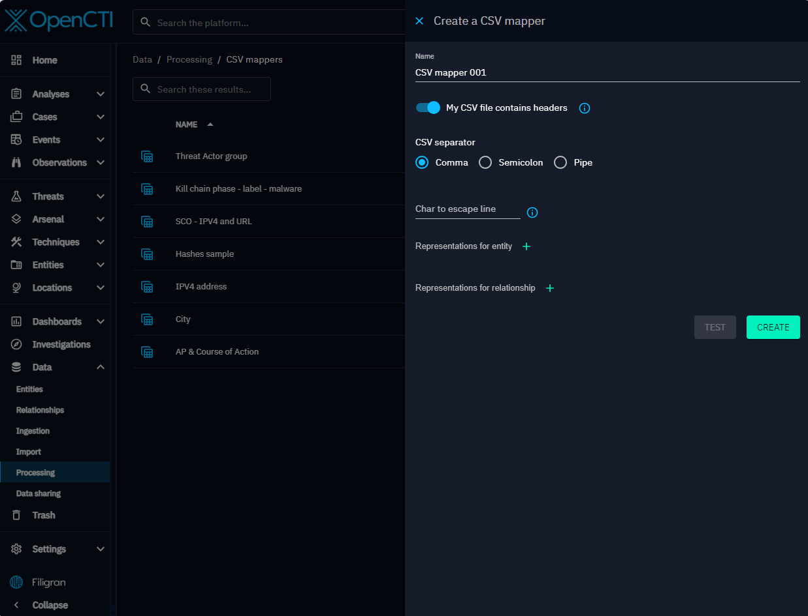

Then, you need to create every representation, one per entity and relationship type represented in the CSV file.
Click on the __+__ button to add an empty representation in the list, and click on the chevron to expand the section and configure the representation.

Depending on the entity type, the form contains the fields that are either required (input outlined in red) or optional.
For each field, set the corresponding columns mapping (the letter-based index of the column in the CSV table, as presented in common spreadsheet tools). 

References to other entities should be picked from the list of all the other representations already defined earlier in the mapper.

You can do the same for all the relationships between entities that might be defined in this particular CSV file structure.


## Create a new reference representation (label, author, markings,..)

If you need to map an entity in your CSV mapper, with **ref attributes as author, markings, label, external references or kill chain phase**. 
First in the field, you must see no options available: 


According to the reference, in this array, you will find the representation you need to configure corresponding to the appropriate attribute:

| Attribute reference | Entity representation | 
|:--------------------|:----------------------|
| author              | Individual            |
| markings            | Marking definition    |
| label               | Label                 |
| external references | External references   |
| kill chain phase    | Kill chain phase      |

For instance in the Attack Pattern, if you want an author, markings, external references and a kill chain phase, you need to add and to configure each new entity below the Attack pattern:
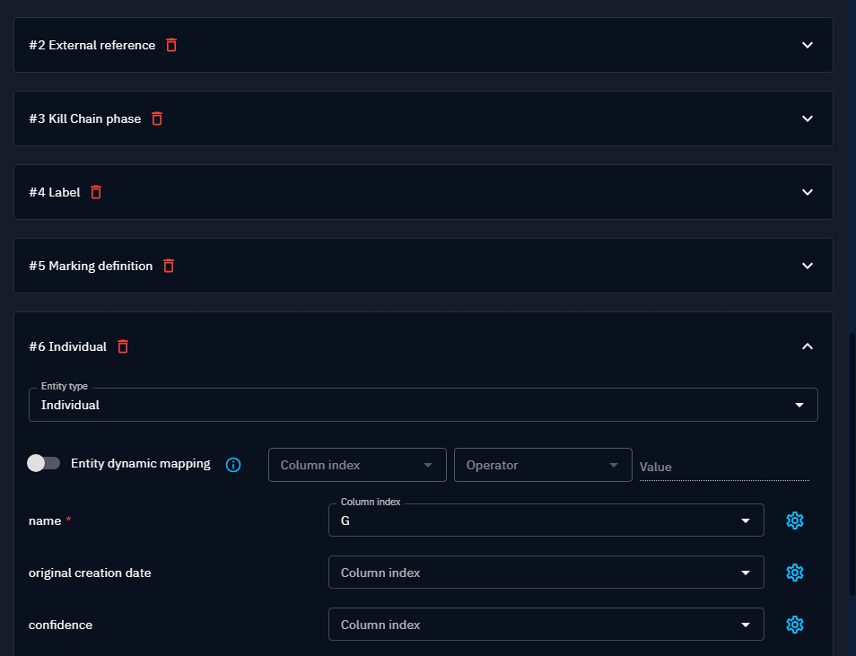

After adding them, you can select those representations in your attack pattern.

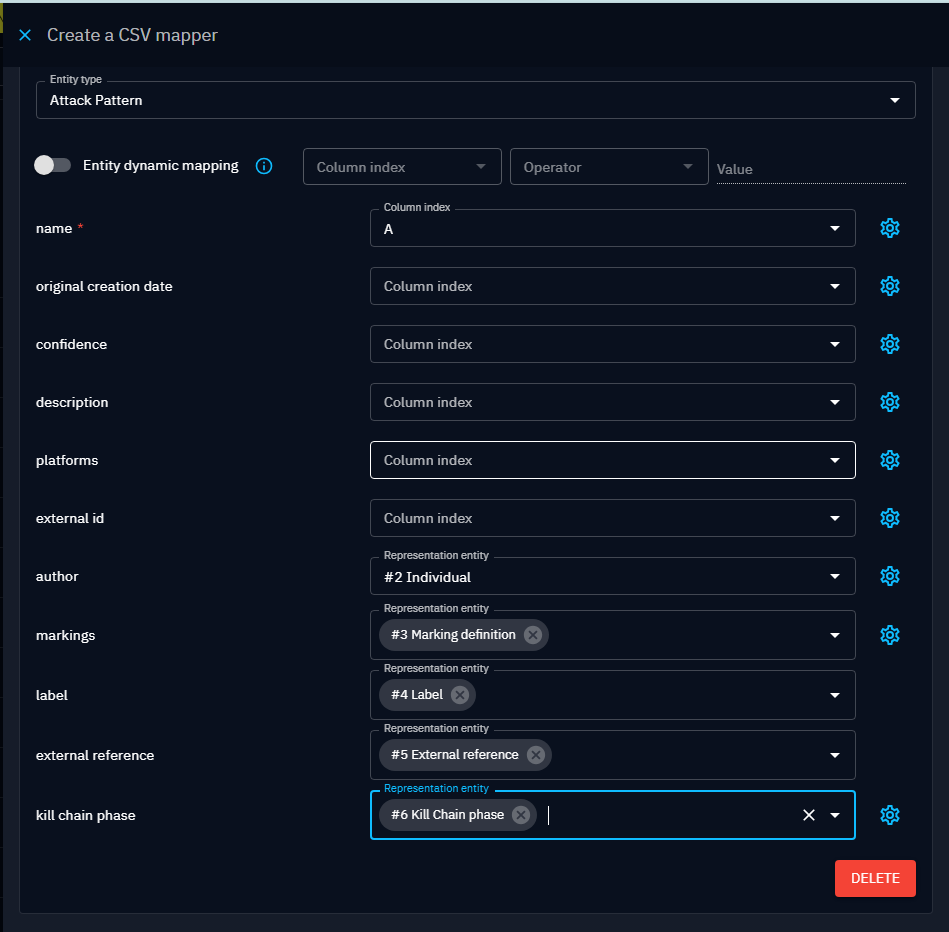


### Entity dynamic mapping

If your CSV file contains multiple entities in separate rows but in the same columns, you can enable "Entity dynamic mapping". 
Click the toggle button to activate it. You must then specify the following:

- the column that contains the differentiator
- the operator ("Equal" or "Not equal")
- the value in this column that we compare with

For instance, if the column A contains the observable type (such as `Ipv4`, `URL`), and the column B the observable value (`1.2.3.4`, `www.example.com`) you can
set 2 representatives for IPv4 and URL entities, with dynamic mapping depending on the content of column A ; column B being used in both representatives as the observable value. 

| Type                                                                         | Value                                                          | 
|:-----------------------------------------------------------------------------|:---------------------------------------------------------------|
| IPv4                                                    | 1.2.3.4                                     |
| IPv4                                                    | 1.2.3.5                                     |
| URL                                                    | www.example.com                                     |
| IPv4                                                    | 1.2.3.6                                     |


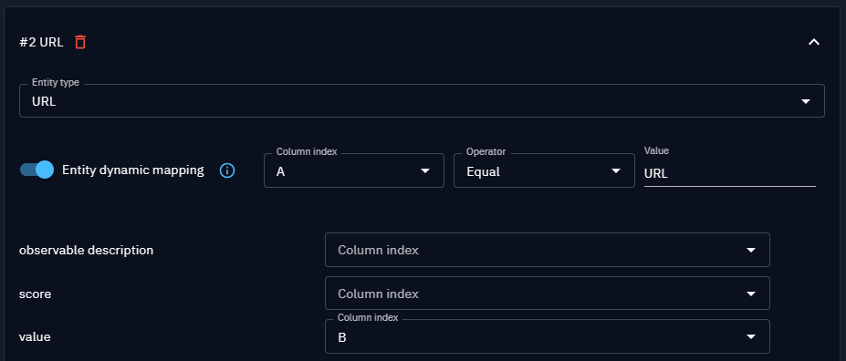

### Field options

Fields might have options besides the mandatory column index, to help extract relevant data:

- __Date__ values are expected in [ISO 8601](https://en.wikipedia.org/wiki/ISO_8601?oldformat=true) format, but you can set your own format to the time parser
- __Multiple values__ can be extracted by specifying the separator used inside the cell (e.g. `+` or `|`)

Or to set default values in case some data is missing in the imported file.

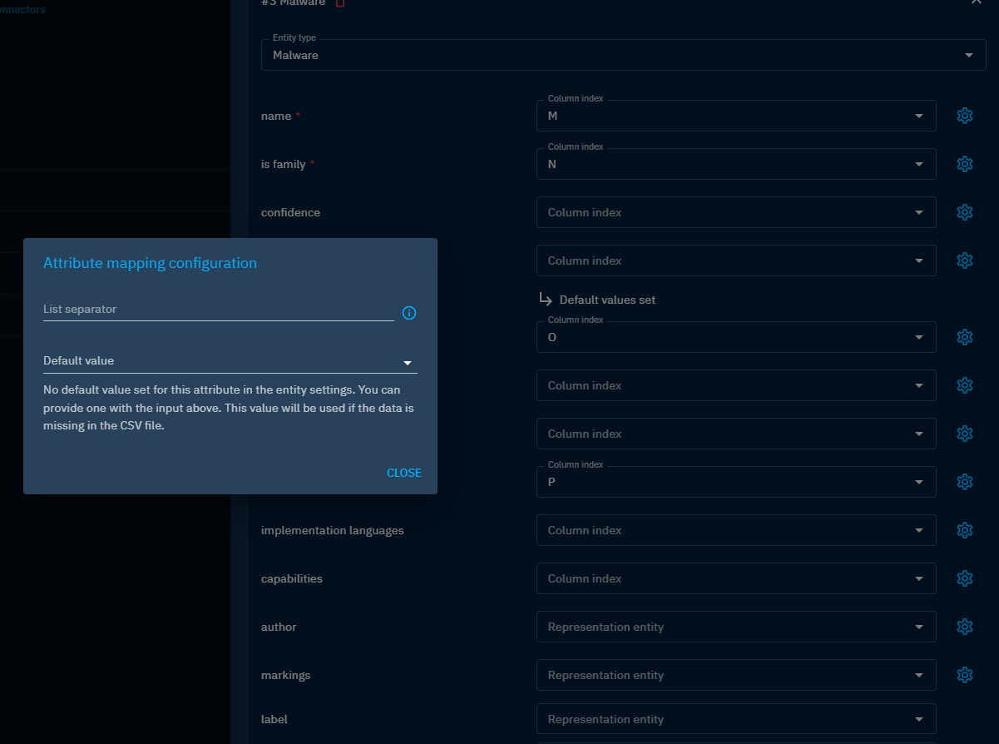

## CSV Mapper validity

The only parameter required to save a CSV Mapper is a name. The creation and refinement of its representations can be done iteratively.

Nonetheless, all CSV Mappers go through a quick validation that checks if all the representations have all their mandatory fields set. 
Only valid mappers can be run by the users on their CSV files.

Mapper validity is visible in the list of CSV Mappers as shown below.

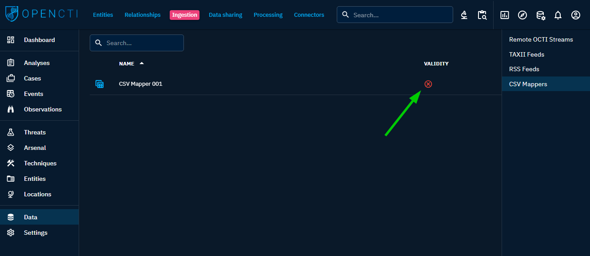

## Test your CSV mapper

In the creation or edition form, hit the button __Test__ to open a dialog. Select a sample CSV file and hit the __Test__ button.

The code block contains the raw result of the parsing attempt, in the form of a STIX 2.1 bundle in JSON format.

You can then check if the extracted values match the expected entities and relationships.

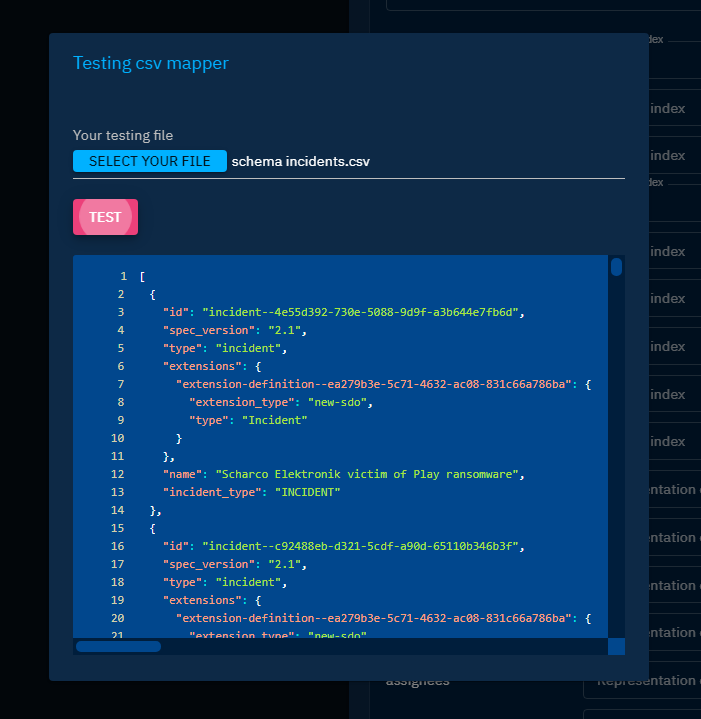

!!! warning "Partial test"

    The test conducted in this window relies only on the translation of CSV data according to the chosen representation in the mapper. It does not take into account checks for accurate entity formatting (e.g. IPv4) or specific entity configurations (e.g. mandatory "description" field on reports). Consequently, the entities visible in the test window may not be created during the actual import process.

!!! warning "Test with a small file"

    The test is a blocking process for the platform. We strongly recommend limiting test files to 100 lines and 1MB, to prevent performance issues.


## Use a mapper for importing a CSV file

You can change the default configuration of the import csv connector in your configuration file.

```json
"import_csv_built_in_connector": {
  "enabled": true, 
  "interval": 10000, 
  "validate_before_import": false
},
```

In Data import section, or Data tab of an entity, when you upload a CSV, you can select a mapper to apply to the file. 
The file will then be parsed following the representation rules set in the mapper.

By default, the imported elements will be added in a new Analyst Workbench where you will be able to check the result of the import.

## Default values for attributes

In the case of the CSV file misses some data, you can complete it with default values. To achieve this, you have two possibilities:

- Set default values in the settings of the entities,
- Set default values directly in the CSV mapper.

### Set default values in the settings of the entities

!!! info "Default value mechanisms"

    Note that adding default values in settings have an impact at entity creation globally on the platform, not only on CSV mappers. If you want to apply those default values only at CSV mapper level, please use the second option.

In _settings_ __>__ _Customization_, you can select an entity type and then set default values for its attributes.

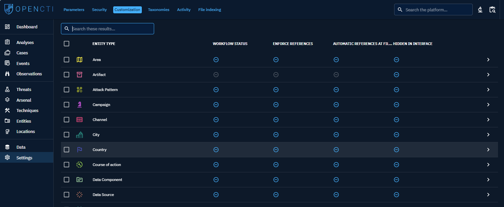

In the configuration of the entity, you have access to the entity's attributes that can be managed.

Click on the attribute to add a __default value__ information.


Enter the __default value__ in the input and save the update.

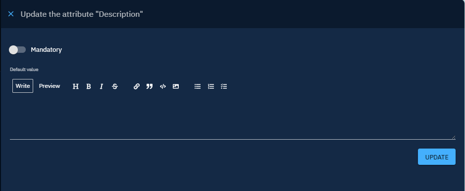

The value filled will be used in the case where the CSV file lacks data for this attribute.

### Set specific default values directly in the CSV mapper

!!! info "Information retained in case of default value"

    If you fill a default value in entity settings and the CSV mapper, the one from CSV mapper will be used.

In the mapper form, you will see next to the column index input a gear icon to add extra information for the attribute. If the attribute can have a customizable default value, then you will be able to set one here.

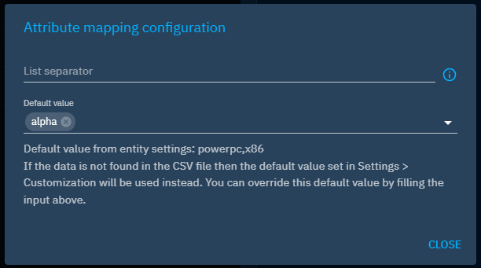

The example above shows the case of the attribute `architecture implementation` of a malware. You have some information here. First, it seems we have a default value already set in entity settings for this attribute with the value `[powerpc, x86]`. However, we want to override this value with another one for our case: `[alpha]`.

### Specific case of marking definitions

For marking definitions, setting a default value is different from other attributes. We are not choosing a particular marking definition to use if none is specified in the CSV file. Instead, we will choose a default policy. Two option are available:

- Use the default marking definitions of the user. In this case the default marking definitions of the connected user importing the CSV file will be used,
- Let the user choose marking definitions. Here the user importing the CSV file will choose marking definitions (among the ones they can see) when selecting the CSV mapper.

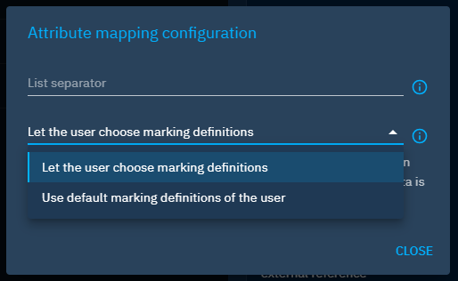

### Duplicate the configuration of the CSV mappers

If you need to modify your previous configuration, we recommend to duplicate the CSV mapper using the duplicate option in the burger button.


As you see, when you duplicate your CSV mapper, the fields are pre-filled but you can change any of them. We advice you to keep the name with '-copy' to signify the origin of the duplicate CSV.

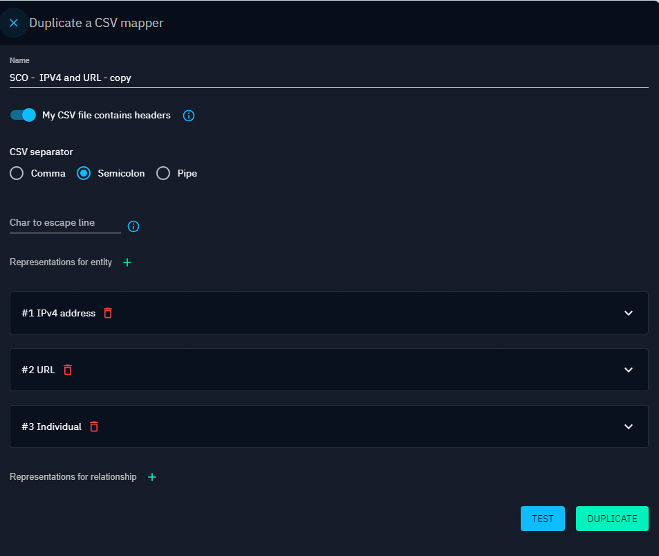

You can always verify your configuration before validating the form (with a file containing 100 lines max).


## Additional resources

- **Usefulness:** To additional content on entity customization, refers to the [Customize entities](./entities.md) page in the Administration section of the documentation.
