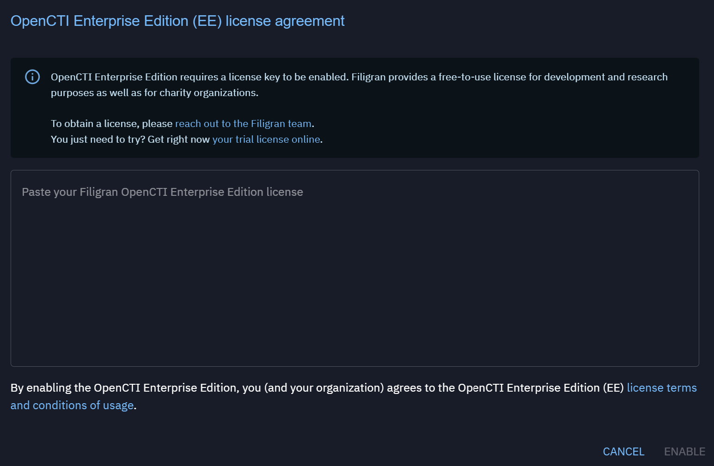

!!! tip "Filigran"

    [Filigran](https://filigran.io) is providing an [Enterprise Edition](https://filigran.io/offerings/opencti-enterprise-edition) of the platform, whether [on-premise](https://filigran.io/offerings/professional-support-packages) or in the [SaaS](https://filigran.io/offerings/software-as-a-service).

## What is OpenCTI EE?

OpenCTI Enterprise Edition is based on the open core concept. This means that the source code of OCTI EE remains open source and included in the main GitHub repository of the platform but is published under a specific license. As specified in the GitHub license file:

- The OpenCTI Community Edition is licensed under the Apache License, Version 2.0 (the "Apache License").
- The OpenCTI Enterprise Edition is licensed under the OpenCTI Enterprise Edition License (the "Enterprise Edition License").

The source files in this repository have a header indicating which license they are under. If no such header is provided, this means that the file belongs to the Community Edition under the Apache License, Version 2.0.

## EE Activation
Enterprise edition is easy to activate. You need to go the platform settings and click on the Activate button.

Then you will need to put a valid OpenCTI EE license. If you don't have it, you can [generate a trial license](https://filigran.io/enterprise-editions-trial/). 

As a reminder, Filigran can provide free-to-use licenses for development and research purposes as well as for non-governmental charity organizations.

## Available features

### Activity monitoring

Audit logs help you answer "who did what, where, and when?" within your data with the maximum level of transparency. Please read [Activity monitoring page](audit/overview.md) to get all information.

### Playbooks and automation

OpenCTI playbooks are flexible automation scenarios which can be fully customized and enabled by platform administrators to enrich, filter and modify the data created or updated in the platform. Please read [Playbook automation page](../usage/automation.md) to get all information.

### Organizations management and segregation

Organizations segregation is a way to segregate your data considering the organization associated to the users. Useful when your platform aims to share data to multiple organizations that have access to the same OpenCTI platform. Please read [Organizations RBAC](../administration/organization-segregation.md) to get more information.

### Authorized Members

On the top of organizations management and segregation, use authorized members to restrict access to a specifc instance (entity/observable). This is particually useful if a specific incident occurs and you need to hide the case tracking the resolution to all the users of the platform, or to control who can edit, who can view and who can manage the entity. Please read [Authorized Members page](https://docs.opencti.io/latest/administration/authorized-members/) to get all information.

### Full text indexing

Full text indexing grants improved searches across structured and unstructured data. OpenCTI classic searches are based on metadata fields (e.g. title, description, type) while advanced indexing capability  enables  searches  to  be  extended  to  the document’s contents. Please read [File indexing](../administration/file-indexing.md) to get all information.

### AI Insights

Ability to read summary of reports and activities of threats with forecasting.

### Natural Language Processing

Automatic extraction of entities and relationships from raw text (PDF, etc.).

### Natural Language Query

Automatic extraction of filters to display a filtered entities list from a question or assertion (please read [Natural Language Query](../usage/refine-content.md#nlq-section)).

### Fintel templates

Finished intelligence templates are models that can be used in containers to generate reports. Those reports can contain texts and visualizations and can be exported in pdf. Fintel templates can be created and managed in the Customization section (please read  [Fintel templates customization](./entities.md)).

### Dissemination list

Dissemination lists are email lists that are used to be send documents (pdf/html) to the right audience. Combined with Fintel Templates, this feature allow you to send  finished intelligence document to the appropriate list of recipients.

### Email Template

Use email template to create templates of email to be sent to your users. Leverage this functionality to automatically send emails to the users you have created without the need of sending them credentials. Additionnally, you can for instance, use these templates to warn all your users of a maintenance window.

## More to come

More features will be available in OpenCTI in the future. Features like:

- Generative AI for correlation and content generation.
- Supervised machine learning for natural language processing.
