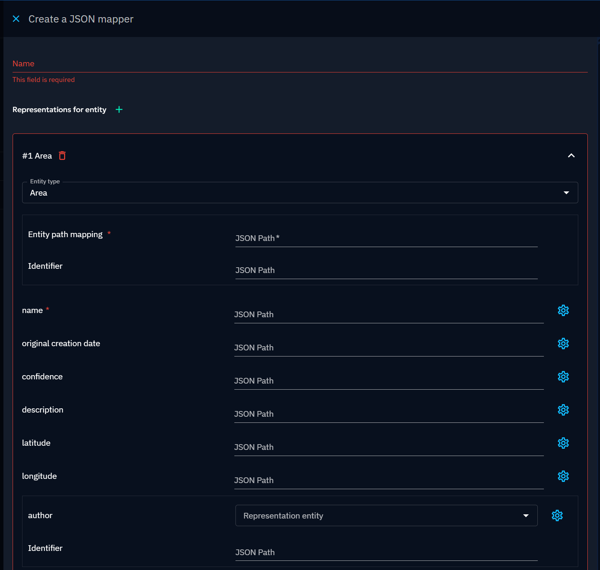
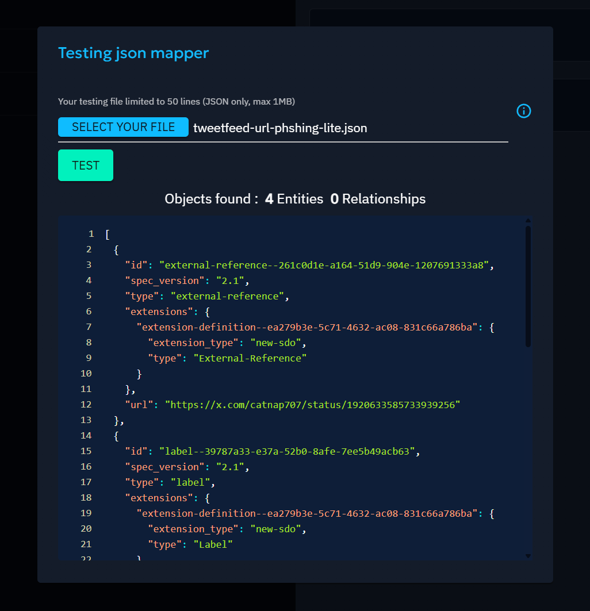

# JSON Mappers

In OpenCTI, JSON Mappers allow to parse JSON files in a STIX 2.1 Object. The mappers are created and configured by users with the Manage data mappers capability. Then, they are available to users who create JSON feeds.

## Principles

The mapper contains __representations__ of STIX 2.1 entities and relationships, in order for the parser to properly extract them. One mapper is dedicated to parsing a specific JSON structure, and thus dedicated mappers should be created for every specific JSON structure you might need to ingest in the platform.

## Create a new JSON Mapper

In menu _Data_, select the submenu _Processing_, and on the right menu select _JSON Mappers_. You are presented with a list of all the mappers set in the platform. Note that you can delete or update any mapper from the context menu via the burger button beside each mapper.

Click on the button __+__ in the bottom-right corner to add a new Mapper.

Enter a name for your mapper and create every representation you need, one per entity and relationship type represented in the JSON structure.
Click on the __+__ button to add an empty representation in the list, and click on the chevron to expand the section and configure the representation.

Depending on the entity type, the form contains the fields that are either required (input outlined in red) or optional.
For each field, set the corresponding path mapping that will be used to capture the data and the one to capture how to uniquely identify the information.

!!! info "JSON path"

    The parser will extract the information through [json path](https://en.wikipedia.org/wiki/JSONPath)

    OpenCTI is currently using the nodejs [JSONPath-Plus](https://github.com/JSONPath-Plus/JSONPath) library

!!! warning "Identifier"

    A complex requirement to understand is the need to map data identifier in the json mapper. Unlike the csv mapper,
    the json structure is a tree and as the mapper is a flat representation of the information, its mandatory to tell
    the system how to reconciliate the information.

    As it something not really easy to understand, its better to explain this by example.
    Please take times to read [Example of mapper, path and identifier](#mapper-path-identifier)

References to other entities should be picked from the list of all the other representations already defined earlier in the mapper.

You can do the same for all the relationships between entities that might be defined in this particular JSON structure.

## Create a new reference representation (label, author, markings,..)

**Reference attributes** like author, markings, label, external references or kill chain phase, are modeled in the platform as entities. 
As such, they should be extracted from the JSON through new entity representations in the mapper.
You can find more information in [csv mapper documentation](csv-mappers.md#new-reference-representation) as is the same concept.

### Field options

Fields might have options besides the mandatory path. The explanation is the same as describe in [csv mapper documentation](csv-mappers.md#field-options)

## JSON Mapper validity

The only parameter required to save a JSON Mapper is a name. The creation and refinement of its representations can be done iteratively.

Nonetheless, all JSON Mappers go through a quick validation that checks if all the representations have all their mandatory fields set. 
Only valid mappers can be run by the users on their JSON files.

Mapper validity is visible in the list of JSON Mappers as shown below.

## Test your JSON mapper

In the creation or edition form, hit the button __Test__ to open a dialog. Select a sample JSON file and hit the __Test__ button.

The code block contains the raw result of the parsing attempt, in the form of a STIX 2.1 bundle in JSON format.

You can then check if the extracted values match the expected entities and relationships.

!!! warning "Partial test"

    The test conducted in this window relies only on the translation of JSON data according to the chosen representation in the mapper. It does not take into account checks for accurate entity formatting (e.g. IPv4) or specific entity configurations (e.g. mandatory "description" field on reports). Consequently, the entities visible in the test window may not be created during the actual import process.

!!! warning "Test with a small file"

    The test is a blocking process for the platform. We strongly recommend limiting test files to 100 lines and 1MB, to prevent performance issues.

## Default values for attributes

In the case of the JSON misses some data, you can complete it with default values. To achieve this, you have two possibilities.
The explanation is the same as describe in [csv mapper documentation](csv-mappers.md#default-values-for-attributes)

## Example of mapper, path and identifier

The mapping is done in multiple phases for each representation.

1. Use a JSON path to get the list of elements to bind for the representation: **Entity path mapping**
2. Bind the identifier and all attributes defined in the mapping.
3. Bind the related elements based on their data resolved identifiers

In some simple configuration it since a bit too much complex to associate the identifiers as it will be represented by the inner values.

To have a deeper understanding of how it works and how its need to be configured, please consult this figma diagram that document the step in a real case mapping. 

<iframe style="border: 1px solid rgba(0, 0, 0, 0.1);" width="800" height="450" src="https://embed.figma.com/board/HJZTHA0uFiFUC76W2dv7vn/JSON-mapper?node-id=0-1&embed-host=share" allowfullscreen></iframe>

## Additional resources

- **Usefulness:** To additional content on entity customization, refers to the [Customize entities](./entities.md) page in the Administration section of the documentation.
