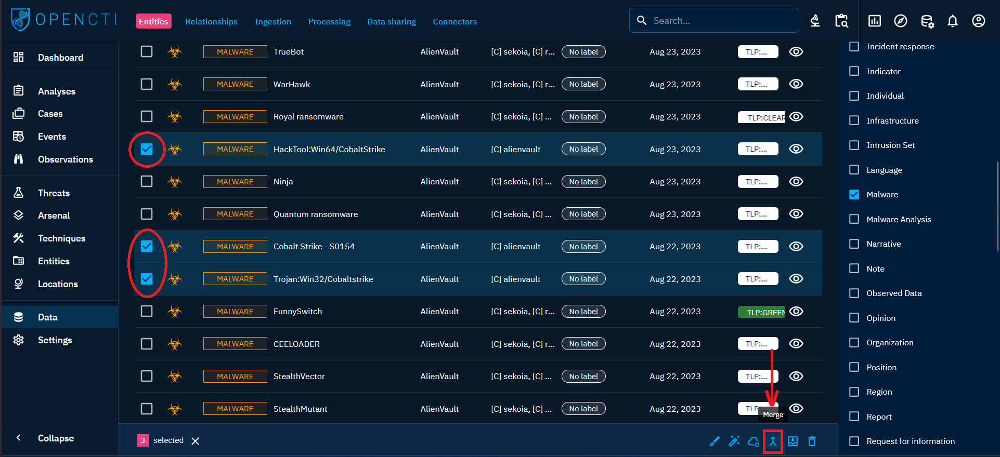

# Merging

## Data merging

Within the OpenCTI platform, the merge capability is present into the "Data > Entities" tab, and is fairly straightforward to use. To execute a merge, select the set of entities to be merged, then click on the Merge icon. NB: it is not possible to merge entities of different types, nor is it possible to merge more than 4 entities at a time (it will have to be done in several stages).

Central to the merging process is the selection of a main entity. This primary entity becomes the anchor, retaining crucial attributes such as name and description. Other entities, while losing specific fields like descriptions, are aliased under the primary entity. This strategic decision preserves vital data while eliminating redundancy.

Once the choice has been made, simply validate to run the task in the background. Depending on the number of entity relationships, and the current workload on the platform, the merge may take more or less time. In the case of a healthy platform and around a hundred relationships per entity, merge is almost instantaneous.

## Data preservation and relationship continuity

A common concern when merging entities lies in the potential loss of information. In the context of OpenCTI, this worry is alleviated. Even if the merged entities were initially created by distinct sources, the platform ensures that data is not lost. Upon merging, the platform automatically generates relationships directly on the merged entity. This strategic approach ensures that all connections, regardless of their origin, are anchored to the consolidated entity. Post-merge, OpenCTI treats these once-separate entities as a singular, unified entity. Subsequent information from varied sources is channeled directly into the entity resulting from the merger. This unified entity becomes the focal point for all future relationships, ensuring the continuity of data and relationships without any loss or fragmentation.

## Important considerations

- **Irreversible process:** It's essential to know that a merge operation is irreversible. Once completed, the merged entities cannot be reverted to their original state. Consequently, careful consideration and validation are crucial before initiating the merge process.
- **Loss of fields in aliased entities:** Fields, such as descriptions, in aliased entities - entities that have not been chosen as the main - will be lost during the merge. Ensuring that essential information is captured in the primary entity is crucial to prevent data loss.

## Additional resources

- **Usefulness:** To understand the benefits of entity merger, refer to the [Merge objects](../usage/merging.md) page in the User Guide section of the documentation.
- **Deduplication mechanism:** the platform is equipped with [deduplication processes](../usage/deduplication.md) that automatically merge data at creation (either manually or by importing data from different sources) if it meets certain conditions.