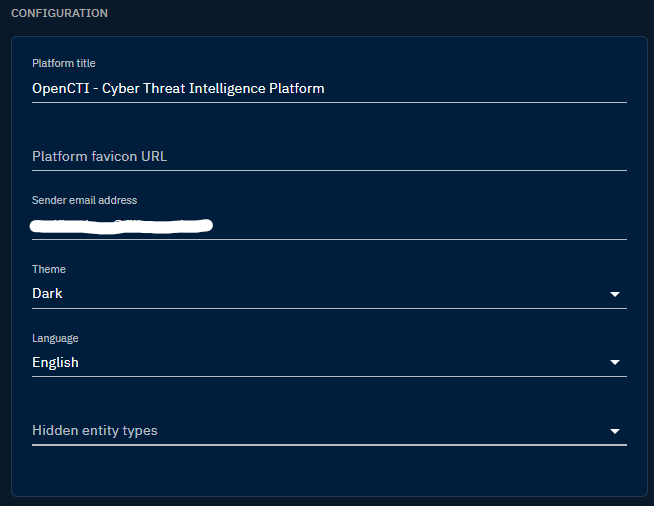
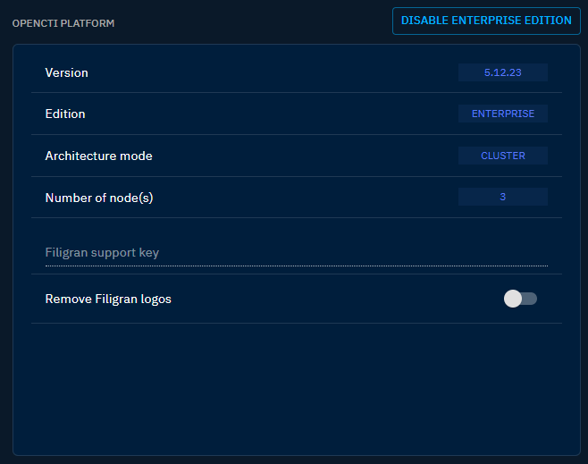
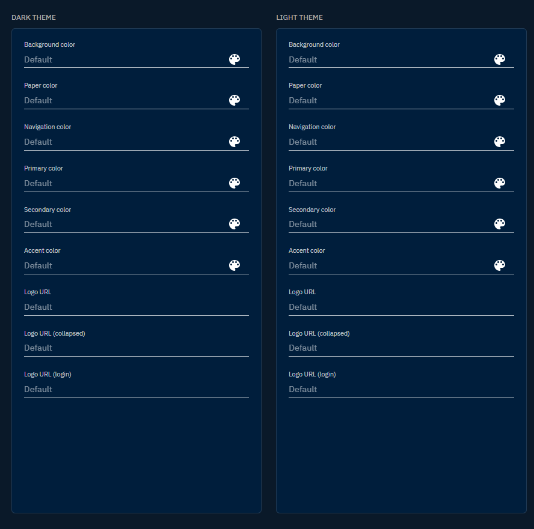

# Parameters

## Description

This part of the interface wil let you configure global platform settings, like title, favicon, etc.

It will also give you important information about the platform.

## The "Configuration" section

This section allows the administrator to edit the following settings:

- Platform title
- Platform favicon URL
- Sender email address: email address displayed as sender when sending notifications. The technical sender is defined in the [SMTP configuration](../deployment/configuration.md#smtp-service).
- Theme
- Language
- Hidden entity types: allows you to customize which types of entities you want to see or hide in the platform. This can help you focus on the relevant information and avoid cluttering the platform with unnecessary data.

## OpenCTI Platform

This is where the [Enterprise edition](enterprise.md) can be enabled.

This section gives important information about the platform like the used version, the edition, the architecture mode (can be Standalone or Cluster) and the number used nodes.

Through the "Remove Filigran logos" toggle, the administrator has the option to hide the Filigran logo on the login page and the sidebar.

## Platform Announcement

This section gives you the possibility to set and display Announcements in the platform. Those announcements will be visible to every user in the platform, on top of the interface.

They can be used to inform some of your users or all of important information, like a scheduled downtime, an incoming upgrade, or even to share important tips regarding the usage of the platform.

An Announcement can be accompanied by a "Dismiss” button. When clicked by a user, it makes the message disappear for this user.

This option can be deactivated to have a permanent announcement.

⚠️ Only one announcement is shown at a time, with priority given to dismissible ones. If there are no dismissible announcements, the most recent non-dismissible one is shown.

## Third-party Analytics

!!! tip "Enterprise edition"

    Analytics is available under the "Filigran entreprise edition" license.

    [Please read the dedicated page to have more information](enterprise.md)

<<<<<<< HEAD
This is where you can configure analytics providers. At the moment only Google analytics v4 is supported.

## Theme customization

In this section, the administrator can customize the two OpenCTI themes

## Tools

This section informs the administrator of the statuses of the different managers used in the Platform. More information about the managers can be found [here](../deployment/managers.md).
It shows also the used versions of the search engine database, RabbitMQ and Redis.

In cluster mode, the fact that a manager appears as enabled means that it is active in at least one node. 

Configure analytics providers (at the moment only Google analytics v4).
