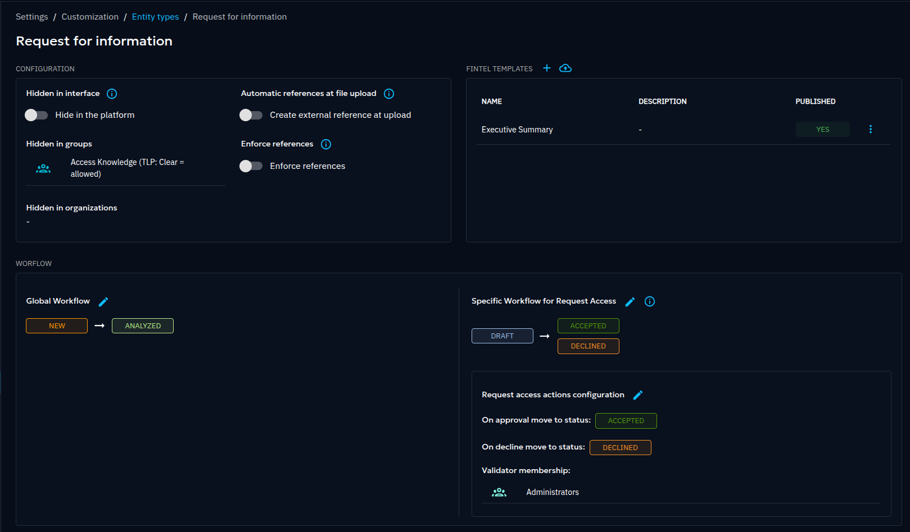
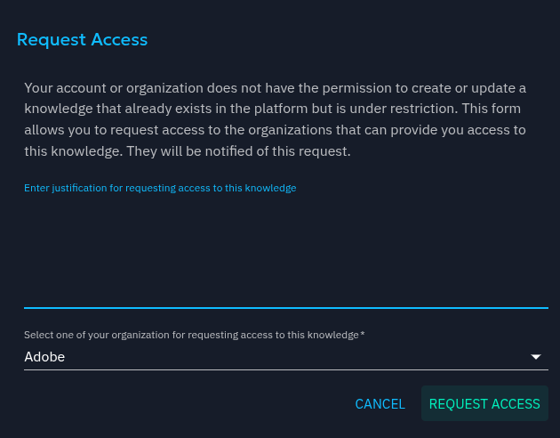

# Requesting knowledge sharing within Organization segregation

!!! tip "Enterprise edition"

    Platform segregation by organization is available under the "OpenCTI Enterprise Edition" license. Please read the [dedicated page](enterprise.md) to have all the information.

Knowledge that exist in the platform can be shared to one organization but not another: some time existing knowledge is hidden to users because it's restricted to another organization than the user's one. See [organization segregation](../organization-segregation) to learn about organization sharing.

When users creates knowledge that already exists in the platform but is not visible for any restrictions reasons, a generic error message `Restricted entity already exists` is displayed.

Platform administrator can configure a request access workflow to allows users to request access to a knowledge that already exists but is not visible because of organization restriction. This workflow will create a specific Request For Information.

## Configuration to allows users to request access to restricted knowledge

### Configuration of the Request For Information settings

Open the configuration of request for information entity.

Configure the "Specific workflow for request access:

1. Configure all status that can be used for request access use case. Note that the `Request for Information` will be created with the first status in this list.

1. Configure the status that will be used when the request is accepted

1. Configure the status that will be used when the request is declined

1. Configure the group that will be allowed to see the `Request for Information` created automatically by the platform.

## Requesting an access

Once the configuration is complete, user that attempt to create an existing knowledge will have a new button "Request Access" proposed.

Then users will be able to give more detail on reason that lead to this request, select one of their organization and request access.

### Accepting or declining a request to access to knowledge

Users that are both:
- in the organization where the knowledge actually belong
- in the group that has been configured in Request for information entity settings

Will receive a dedicated Request for information for example:

> Note that this specific Request for Information is automatically under [authorized member restricted access](../authorized-members) for confidentiality reason.

The knowledge that is requested to be shared, can be found in related entities.
There is two dedicated button "Validate" and "Decline": with one click on Validate, the knowledge will be shared as requested.

User that are allowed to see the dedicated Request for Information and allowed to share the knowledge, will also be notified on dedicated Request for Information creation.
