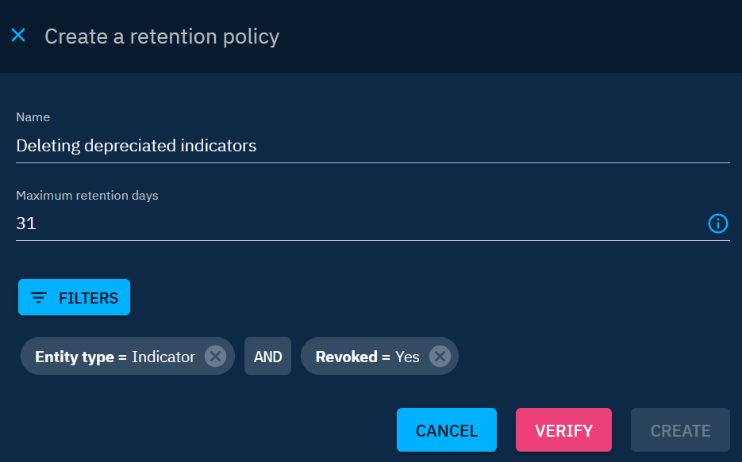

# Retention policies

Retention rules serve the purpose of establishing data retention times, specifying when data should be automatically deleted from the platform. Users can define filters to target specific objects. Any object meeting these criteria that haven't been updated within the designated time frame will be permanently deleted.

## Configuration

Retention rules can be configured in the "Settings > Customization > Retention policies" window. A set of parameters must be configured:

- Maximum retention days: Set the maximum number of days an object can remain unchanged before being eligible for deletion.
- Filters: Define filters based on specific criteria to select the types of objects subject to retention rules.
 
An object will be removed if it meets the specified filters and hasn't been updated for the duration set in the "Maximum retention days" field.

## Verification process

Before activating a retention rule, users have the option to verify its impact using the "Verify" button. This action provides insight into the number of objects that currently match the rule's criteria and would be deleted if the rule is activated.

!!! warning "Verify before activation"

    Always use the "Verify" feature to assess the potential impact of a retention rule before activating it. Once the rule is activated, data deletion will begin, and retrieval of the deleted data will not be possible.

Retention rules contribute to maintaining a streamlined and efficient data lifecycle within OpenCTI, ensuring that outdated or irrelevant information is systematically removed from the platform, thereby optimizing disk space usage.
