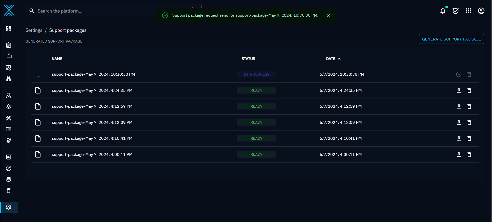

# Support Package

Support packages are usefull for troubleshooting issue that occurs on OpenCTI platform.
Administrators can request to create and download a support package that contains recent platform error logs and usage statistics.

Support Package can be requested from "Settings > Support" menu.

1. On a click on "Generate support package" button on the top right, the support package is requested.
1. A background task on the platform gathers logs and interesting data and creates an archive

1. When everything is ready, the status is changed to READY and the support package can be downloaded
1. In case of platform instability, some logs might not be retrieve and the support package request may stay "In progress" for ever. In that case it's possible to use the "force download" button to get a partial support package archive. This partial support package archive contains all logs that have been collected so far.