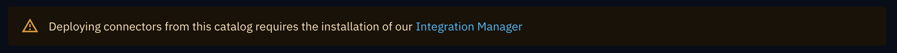
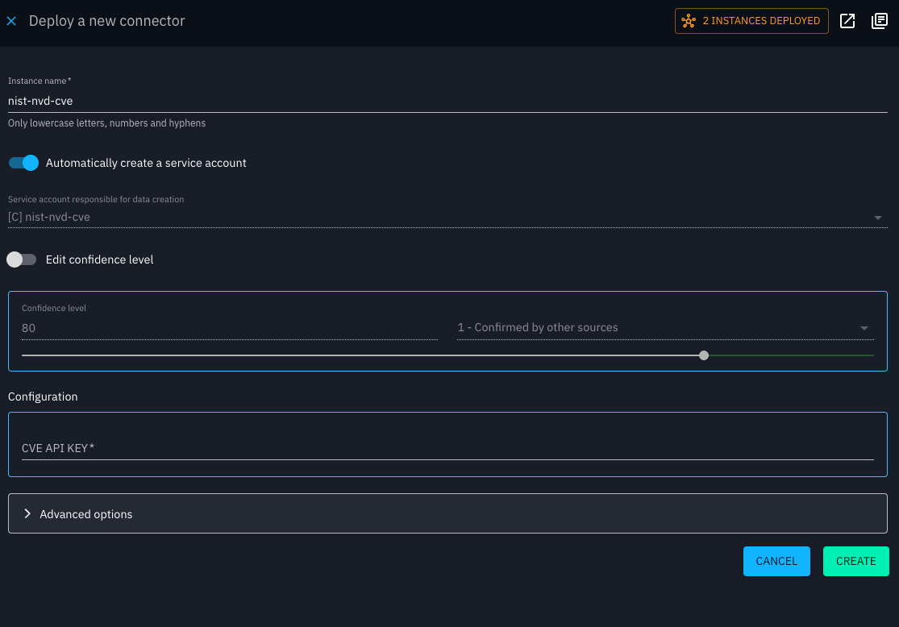

# Integration Manager

## Introduction

The OpenCTI Integration Manager is a deployment tool that simplifies the management and deployment of connectors within the platform. It supports two deployment methods:

- An intuitive web interface for direct UI-based deployment.
- A container-based method for self-hosted deployments requiring infrastructure control.

## How to use in OpenCTI

### Prerequisites

- An **Enterprise Edition license** is required to use this feature. Without it, the catalog is available in read-only mode. You can enter the license key from:
    - the **Deploy** action on a connector card,
    - the connector’s detail view,
    - or the **Settings** page.

- The **Integration Manager** must be installed and operational to deploy connectors.

## Browsing the connector catalog

- Navigate to **Data > Ingestion > Connector Catalog**

- Use the search bar to find connectors by name or description. You can also apply filters (e.g., by connector type or use case).

- If a connector has already been deployed, a **badge** will appear on its **Deploy** button.

- In the configuration dialog header, if an instance is already deployed, you can click the instance button to go directly to the **Ingestion monitoring** page with the connector type pre-filtered.

- The **Details** shows additional information about each connector.

## Deploying a connector

1. Click the **Deploy** button on a connector card. A form will appear with required configuration fields.

2. Fill in the required options (you can also expand **Advanced Options** to configure additional settings):

    - **Instance name**: must be unique.

    - **Service account**: create a new one or use an existing one.

    - **Confidence level**: set the desired confidence level for the service account.

    - **API key**.

    - **Additional options**: connector-specific configuration.

3. Click **Create**. Once the connector is created, you will be redirected to the connector instance view.

!!! note "Connector created"

    Newly created connectors are not started automatically. 
    You can still update their configuration via the **Update** action.
    

5. When ready, click **Start** to run the connector.

6. From the instance view, you can also check the **Logs** tab. The displayed logs depend on the logging level configured.

## Managing the connectors

- Different connector types are identified by their icons:
    - : managed connector by the Integration manager
    - : built-in connector feed
    - : built-in connector deployed

- Connector statuses:
    - Managed connectors: *Started* or *Stopped*.
    - Built-in connectors: *Active* or *Inactive*.

- **Filters in the Monitoring screen** are available only if:
    - The **Enterprise Edition** is enabled, and
    - There is at least one managed connector deployed.

- Only **managed connectors** can be started/stopped from the UI, and only they provide logs in the interface. 

- Updating the configuration of a managed connector is possible. Changes will take effect after a short delay.

- For security reasons, API keys/tokens are never displayed in the UI after being saved.

## Deploying the Integration Manager

To deploy the Integration Manager, please refer to the [installation guide](integration-manager/installation.md)
. The guide provides step-by-step instructions for setting up and configuring the service in your environment.

