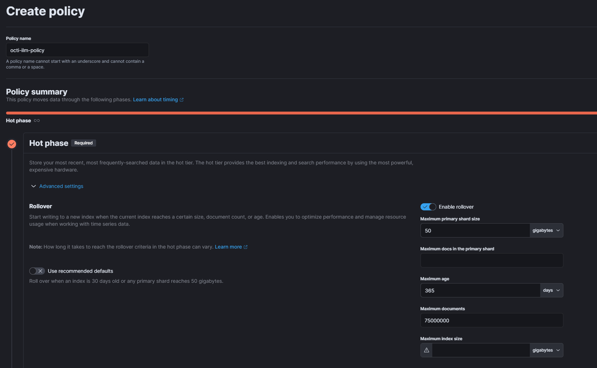
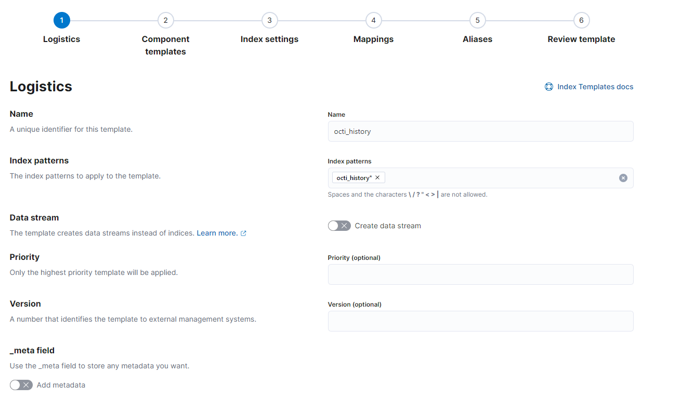
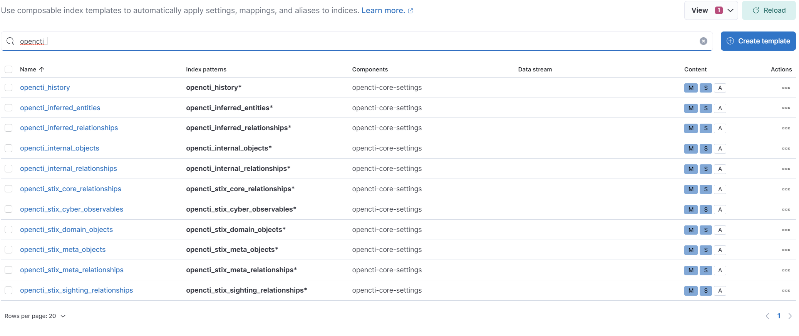
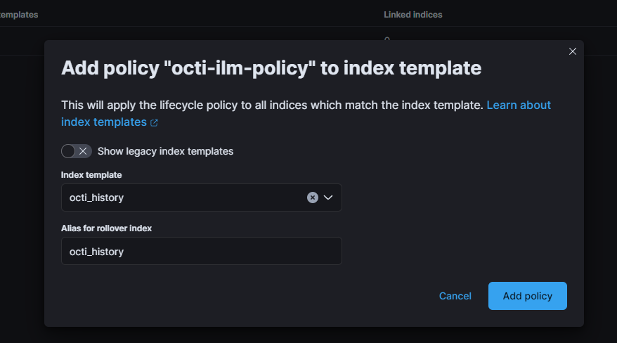

# Indices and rollover policies

!!! note "Default rollover policies"

    Since OpenCTI 5.9.0, rollover policies are automatically created when the platform is initialized for the first time. If your platform has been initialized using an older version of OpenCTI or if you would like to understand (and customize) rollover policies please read the following documentation.

## Introduction

ElasticSearch and OpenSearch both support rollover on indices. OpenCTI has been designed to be able to use aliases for indices and so supports index lifecycle policies very well. Thus, by default OpenCTI initializes indices with a suffix of `-00001` and uses wildcards to query indices. When rollover policies are implemented (default starting OCTI 5.9.X if you initialized your platform at this version), indices are splitted to keep a reasonable volume of data in shards.


## OpenCTI Integration User Permissions in OpenSearch/ElasticSearch

- Index Permissions
    - **Patterns:** `opencti*` _(Dependent on the parameter [elasticsearch:index_prefix](configuration.md#elasticsearch) value)_
    - **Permissions:** `indices_all`

- Cluster Permissions
    - `cluster_composite_ops_ro`
    - `cluster_manage_index_templates`
    - `cluster:admin/ingest/pipeline/put`
    - `cluster:admin/opendistro/ism/policy/write`
    - `cluster:monitor/health`
    - `cluster:monitor/main`
    - `cluster:monitor/state`
    - `indices:admin/index_template/put`
    - `indices:data/read/scroll/clear`
    - `indices:data/read/scroll`
    - `indices:data/write/bulk`

!!! warning "About `indices:*` in _Cluster Permissions_"

    It is crucial to include `indices:*` permissions in **Cluster Permissions** for the proper functioning of the OpenCTI integration. Removing these, even if already present in **Index Permissions**, may result in startup issues for the OpenCTI Platform.

## ElasticSearch configuration

### Indices

By default, a rollover policy is applied on all indices used by OpenCTI.

* `opencti_deleted_objects`
* `opencti_files`
* `opencti_history`
* `opencti_inferred_entities`
* `opencti_inferred_relationships`
* `opencti_internal_objects`
* `opencti_internal_relationships`
* `opencti_stix_core_relationships`
* `opencti_stix_cyber_observable_relationships`
* `opencti_stix_cyber_observables`
* `opencti_stix_domain_objects`
* `opencti_stix_meta_objects`
* `opencti_stix_meta_relationships`
* `opencti_stix_sighting_relationships`

For your information, the indices which can grow rapidly are:

* Index `opencti_stix_meta_relationships`: it contains all the nested relationships between objects and labels / marking definitions / external references / authors, etc.
* Index `opencti_history`: it contains the history log of all objects in the platform.
* Index `opencti_stix_cyber_observables`: it contains all observables stored in the platform.
* Index `opencti_stix_core_relationships`: it contains all main STIX relationships stored in the platform.

### Default implemented lifecycle policy

Here is the recommended policy (initialized starting 5.9.X):

* Maximum primary shard size: `50 GB`
* Maximum age: `365 days`
* Maximum documents: `75,000,000`

### Applying rollover policies on existing indices

!!! warning "Procedure information"
    
    Please read the following only if your platform has been initialized before 5.9.0, otherwise lifecycle policies has been created (but you can still cutomize them).

Unfortunately, to be able to implement rollover policies on ElasticSearch / OpenSearch indices, it will be needed to re-index all the data in new indices using ElasticSearch capabilities.

#### Shutdown

First step is to shutdown your OpenCTI platform.

#### Change configuration

Then, in the [OpenCTI configuration](configuration.md), change the ElasticSearch / OpenSearch default prefix to `octi` (default is `opencti`).

#### Create the rollover policy

Create a rollover policy named `octi-ilm-policy` (in Kibana, `Management > Index Lifecycle Policies`):

* Maximum primary shard size: `50 GB`
* Maximum age: `365 days`
* Maximum documents: `75,000,000`



#### Create index templates

In Kibana, clone the `opencti-index-template` to have one index template by OpenCTI index with the appropriate rollover policy, index pattern and rollover alias (in Kibana, `Management > Index Management > Index Templates`).



Create the following index templates:

* `octi_deleted_objects`
* `octi_files`
* `octi_history`
* `octi_inferred_entities`
* `octi_inferred_relationships`
* `octi_internal_objects`
* `octi_internal_relationships`
* `octi_stix_core_relationships`
* `octi_stix_cyber_observable_relationships`
* `octi_stix_cyber_observables`
* `octi_stix_domain_objects`
* `octi_stix_meta_objects`
* `octi_stix_meta_relationships`
* `octi_stix_sighting_relationships`

Here is the overview of all templates (you should have something with `octi_` instead of `opencti_`).



#### Apply rollover policy on all index templates

Then, going back in the index lifecycle policies screen, you can click on the "+" button of the `octi-ilm-policy` to `Add the policy to index template`, then add the policy to add previously created template with the proper "Alias for rollover index".



#### Bootstrap all new indices

Before we can re-index, we need to create the new indices with aliases.

```
PUT octi_history-000001
{
  "aliases": {
    "octi_history": {
      "is_write_index": true
    }
  }
}
```

Repeat this step for all indices:

* `octi_deleted_objects`
* `octi_files`
* `octi_history`
* `octi_inferred_entities`
* `octi_inferred_relationships`
* `octi_internal_objects`
* `octi_internal_relationships`
* `octi_stix_core_relationships`
* `octi_stix_cyber_observable_relationships`
* `octi_stix_cyber_observables`
* `octi_stix_domain_objects`
* `octi_stix_meta_objects`
* `octi_stix_meta_relationships`

#### Re-index all indices

Using the `reindex` API, re-index all indices one by one:

```
curl -X POST "localhost:9200/_reindex?pretty" -H 'Content-Type: application/json' -d'
{
  "source": {
    "index": "opencti_history-000001"
  },
  "dest": {
    "index": "octi_history"
  }
}
'
```

You will see the rollover policy to be applied and the new indices are automatically rolled-over during re-indexation.

#### Delete all old indices

Then just delete all indices with the prefix `opencti_`.

#### Start your platform

Start your platform, using the new indices.

!!! note "Rollover documentation"
    
    To have more details about automatic rollover and lifecycle policies, please read the [official ElasticSearch documentation](https://www.elastic.co/guide/en/elasticsearch/reference/current/index-rollover.html).
