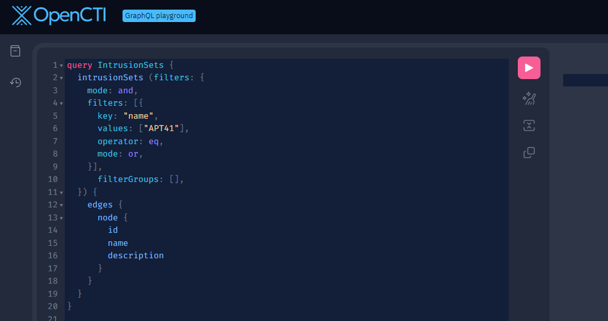
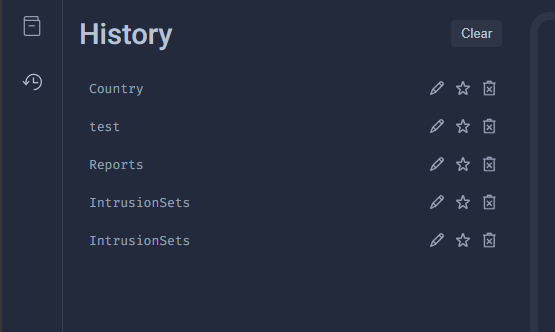
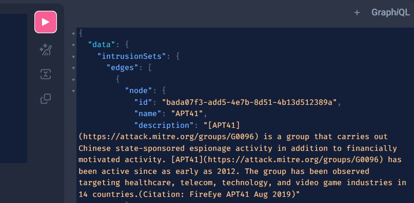
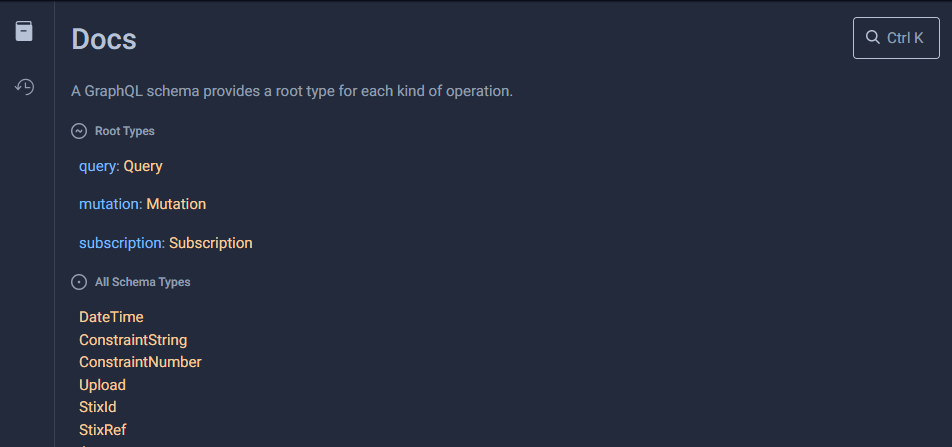

# GraphQL playground

The GraphQL playground is an integrated development environment (IDE) provided by OpenCTI for exploring and testing GraphQL APIs. It offers a user-friendly interface that allows developers to interactively query the GraphQL schema, experiment with different queries, and visualize the responses.

## Key features

### Interactive querying

The Playground provides a text editor where developers can write GraphQL queries, mutations, and subscriptions. As you type, the Playground offers syntax highlighting, autocompletion, and error checking to aid in query composition.

### Documentation

Developers can access comprehensive documentation for the GraphQL schema directly within the Playground. This documentation includes descriptions of all available types, fields, and directives, making it easy to understand the data model and construct queries.

### Query history

The playground keeps track of previously executed queries, allowing developers to revisit and reuse queries from previous sessions. This feature streamlines the development process by eliminating the need to retype complex queries.

### Response visualization

Upon executing a query, the playground displays the response data in a structured and readable format. JSON responses are presented in a collapsible tree view, making it easy to navigate nested data structures and inspect individual fields.

### Schema exploration

Developers can explore the GraphQL schema using the built-in schema viewer. This feature provides a graphical representation of the schema, showing types, fields, and their relationships. Developers can explore the schema and understand its structure.

## Getting started

To access the GraphQL playground, navigate to the GraphQL endpoint of your OpenCTI instance: `https://[your-opencti-instance]/graphql`. Then, follow these steps to utilize the playground:

1. Query editor: Write GraphQL queries, mutations, and subscriptions in the text editor. Use syntax highlighting and autocompletion to speed up query composition.
2. Documentation explorer: Access documentation for the GraphQL schema by clicking on the "Docs" tab on the right. Browse types, fields, and descriptions to understand the available data and query syntax.
3. Query history: View and execute previously executed queries from the "History" tab on the top. Reuse queries and experiment with variations without retyping.
4. Response pane: Visualize query responses in the response pane. Expand and collapse sections to navigate complex data structures and inspect individual fields.
5. Schema viewer: Explore the GraphQL schema interactively using the "Schema" tab on the right. Navigate types, fields, and relationships to understand the data model and plan queries.