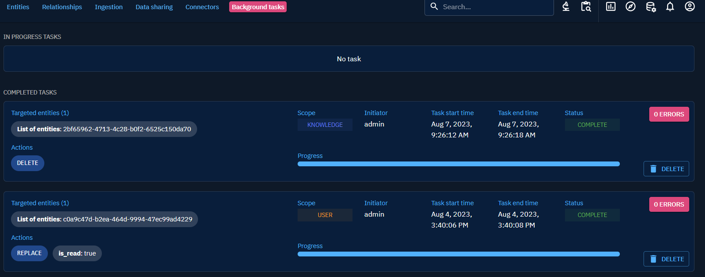

# Background tasks
Three types of tasks are done in the background:
- rule tasks,
- knowledge tasks,
- user tasks.

Rule tasks can be seen and activated in Settings > Customization > Rules engine.
Knowledge and user tasks can be seen and managed in Data > Background Tasks. The scope of each task is indicated.

## Rule tasks
If a rule task is enabled, it leads to the scan of the whole platform data and the creation of entities or relationships in case a configuration correspond to the tasks rules. The created data are called 'inferred data'. Each time an event occurs in the platform, the rule engine checks if inferred data should be updated/created/deleted.

## Knowledge tasks
Knowledge tasks are background tasks updating or deleting entities and correspond to mass operations on these data. To create one, select entities via the checkboxes in an entity list, and choose the action to perform via the toolbar.

### Rights
- To create a knowledge task, the user should have the capability to Update Knowledge (or the capability to delete knowledge if the task action is a deletion).
- To see a knowledge task in the Background task section, the user should be the creator of the task, or have the KNOWLEDGE capability.
- To delete a knowledge task from the Background task section, the user should be the creator of the task, or have the KNOWLEDGE_UPDATE capability.

## User tasks
User tasks are background tasks updating or deleting notifications. It can be done from the Notification section, by selecting several notifications via the checkboxes, and choosing an action via the toolbar.

### Rights
- A user can create a user task on its own notifications only.
- To see or delete a user task, the user should be the creator of the task or have the SET_ACCESS capability.