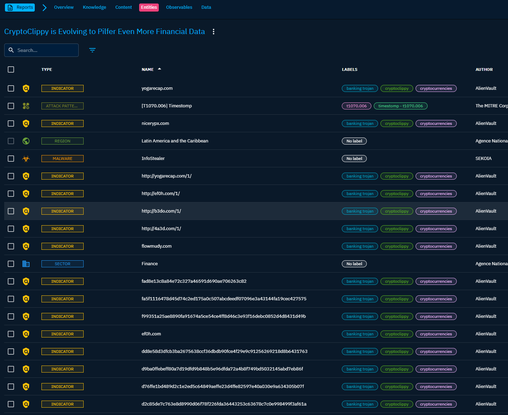
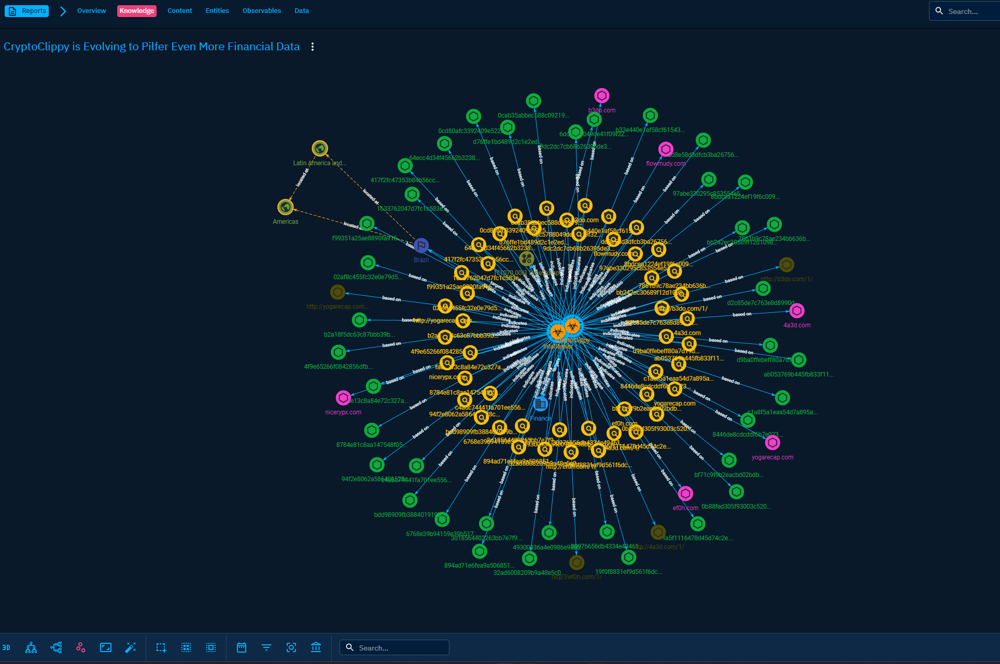

# Containers

## STIX standard

### Definition

In the [STIX 2.1 standard](https://docs.oasis-open.org/cti/stix/v2.1/stix-v2.1.html), some STIX Domain Objects (SDO) can be considered as "container of knowledge", using the `object_refs` attribute to refer multiple other objects as nested references. In `object_refs`, it is possible to refer to entities and relationships. 

### Example

```json
{
   "type": "report",
   "spec_version": "2.1",
   "id": "report--84e4d88f-44ea-4bcd-bbf3-b2c1c320bcb3",
   "created_by_ref": "identity--a463ffb3-1bd9-4d94-b02d-74e4f1658283",
   "created": "2015-12-21T19:59:11.000Z",
   "modified": "2015-12-21T19:59:11.000Z",
   "name": "The Black Vine Cyberespionage Group",
   "description": "A simple report with an indicator and campaign",
   "published": "2016-01-20T17:00:00.000Z",
   "report_types": ["campaign"],
   "object_refs": [
      "indicator--26ffb872-1dd9-446e-b6f5-d58527e5b5d2",
      "campaign--83422c77-904c-4dc1-aff5-5c38f3a2c55c",
      "relationship--f82356ae-fe6c-437c-9c24-6b64314ae68a"
   ]
}
```

In the previous example, we have a nested reference to 3 other objects:

```json
"object_refs": [
   "indicator--26ffb872-1dd9-446e-b6f5-d58527e5b5d2",
   "campaign--83422c77-904c-4dc1-aff5-5c38f3a2c55c",
   "relationship--f82356ae-fe6c-437c-9c24-6b64314ae68a"
]
```

## Implementation

### Types of container

In OpenCTI, containers are displayed differently than other entities, because they contain pieces of knowledge. Here is the list of containers in the platform:

| Type of entity | STIX standard | Description                                                                                                                                                                                 |
|:---------------|:--------------|:--------------------------------------------------------------------------------------------------------------------------------------------------------------------------------------------|
| Report         | Native        | Reports are collections of threat intelligence focused on one or more topics, such as a description of a threat actor, malware, or attack technique, including context and related details. |
| Grouping       | Native        | A Grouping object explicitly asserts that the referenced STIX Objects have a shared context, unlike a STIX Bundle (which explicitly conveys no context).                                    |
| Observed Data  | Native        | Observed Data conveys information about cyber security related entities such as files, systems, and networks using the STIX Cyber-observable Objects (SCOs).                                |
| Note           | Native        | A Note is intended to convey informative text to provide further context and/or to provide additional analysis not contained in the STIX Objects.                                           |
| Opinion        | Native        | An Opinion is an assessment of the correctness of the information in a STIX Object produced by a different entity.                                                                          |
| Case           | Extension     | A case whether an Incident Response, a Request for Information or a Request for Takedown is used to convey an epic with a set of tasks.                                                     |
| Task           | Extension     | A task, generally used in the context of a case, is intended to convey information about something that must be done in a limited timeframe.                                                |

### Containers behavior

In the platform, it is always possible to visualize the list of entities and/or observables referenced in a container (`Container > Entities or Observables`) but also to add / remove entities from the container.



As containers can also contain relationships, which are generally linked to the other entities in the container, it is also possible to visualize the container as a graph (`Container > Knowledge`)



### Containers of an entity or a relationship

On the entity or the relationship side, you can always find all containers where the object is contained using the top menu `Analysis`:


In all containers list, you can also filter containers based on one or multiple contained object(s):


