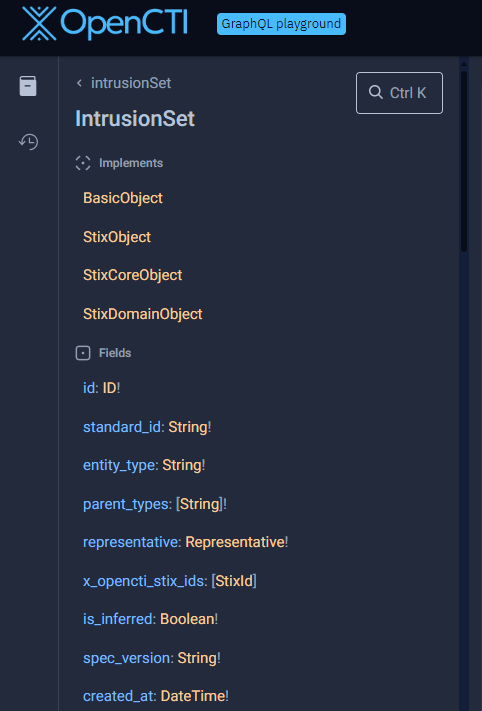

# Data model

## Introduction

The OpenCTI core design relies on the concept of a [knowledge graph](https://en.wikipedia.org/wiki/Knowledge_graph), where you have two different kinds of object:

1. **Nodes** are used to describe `entities`, which have some `properties` or `attributes`.
2. **Edges** are used to describe `relationships`, which are created between two `entity` nodes and have some `properties` or `attributes`.

!!! note "Example"
    
    An example would be that the entity `APT28` has a relationship `uses` to the malware entity `Drovorub`.

## Standard

### The STIX model

To enable a unified approach in the description of threat intelligence knowledge as well as importing and exporting data, the OpenCTI data model is based on the [STIX 2.1 standard](https://docs.oasis-open.org/cti/stix/v2.1/stix-v2.1.html). Thus we highly recommend to take a look to the [STIX Introductory Walkthrough](https://oasis-open.github.io/cti-documentation/stix/walkthrough) and to the [different kinds of STIX relationships](https://oasis-open.github.io/cti-documentation/examples/visualized-sdo-relationships) to get a better understanding of how OpenCTI works.

Some more important STIX naming shortcuts are:

- **STIX Domain Objects (SDO)**: Attack Patterns, Malware, Threat Actors, etc.
- **STIX Cyber Observable (SCO)**: IP Addresses, domain names, hashes, etc.
- **STIX Relationship Object (SRO)**: Relationships, Sightings

### Extensions

In some cases, the model has been extended to be able to:

* Support more types of SCOs to modelize information systems such as cryptocurrency wallets, user agents, etc.
* Support more types of SDOs to modelize disinformation and cybercrime such as channels, events, narrative, etc.
* Support more types of SROs to extend the new SDOs such as`amplifies`, `publishes`, etc.

## Implementation in the platform

### Diagram of types

You can find below the digram of all types of entities and relationships available in OpenCTI.

<iframe style="border: 1px solid rgba(0, 0, 0, 0.1);" width="800" height="450" src="https://www.figma.com/embed?embed_host=share&url=https%3A%2F%2Fwww.figma.com%2Ffile%2FSrp4IQ9xAnzaS043epUZuJ%2FOpenCTI---Models%3Ftype%3Dwhiteboard%26node-id%3D0%253A1%26t%3DDeOZVWsFdJ13c05f-1" allowfullscreen></iframe>

### Attributes and properties

To get a comprehensive list of available properties for a given type of entity or relationship, you can use the GraphQL playground schema available in your "Profile > Playground". Then you can click on the Documentation button on the left. You can for instance search for the keyword `IntrusionSet`:

