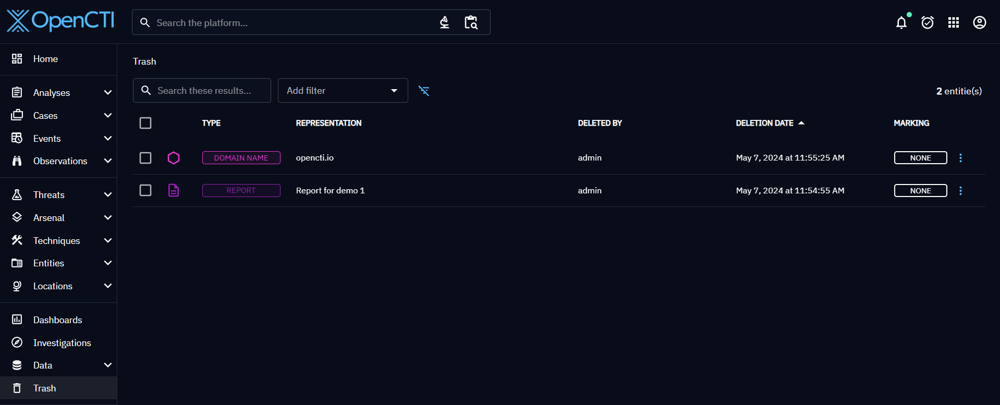
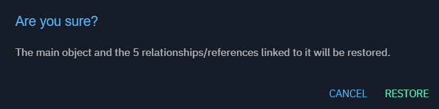
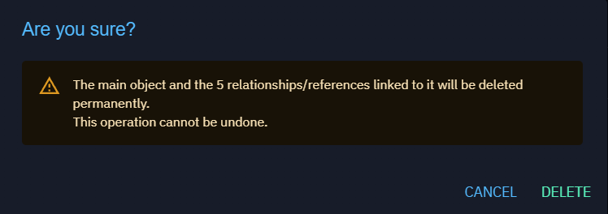

# Delete and restore knowledge

Knowledge can be deleted from OpenCTI either in an overview of an object or using [background tasks](background-tasks.md)

When we delete an object, we also delete all its relationships with other objects.
If we deleted an object by mistake, prior to 6.1 version, there was no way to undo this operation, the knowledge was lost permanently.

Since 6.1 version, it is possible to restore deleted objects.

## Trash

We added a view called "Trash" that will display all deleted operations:

Each deleted object can now be restored or permanently deleted from this view:

## Restore

Restoring an element will create it again in the platform with the same information it had before it has been deleted.
It will also restore all its relationships that have been deleted when deleting the object.
If the object had attached files, they will be also restored.

## Permanent delete

We can also delete permanently the object, its relationships, and attached files (uploaded or exported).

## Trash retention

Deleted objects are kept in trash during 7 days by default, then they are permanently deleted by the trash manager.