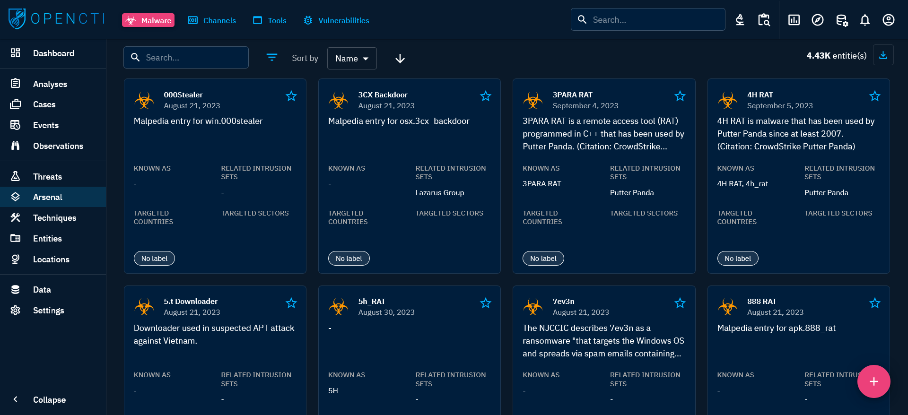
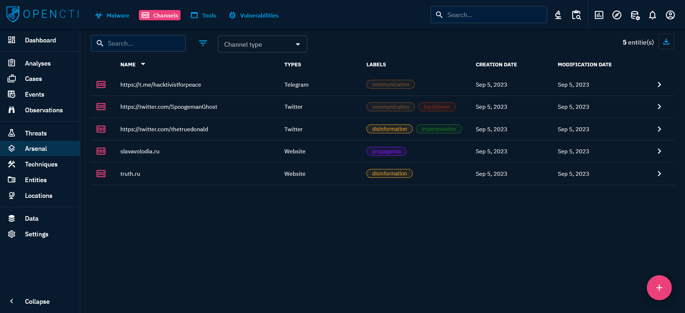
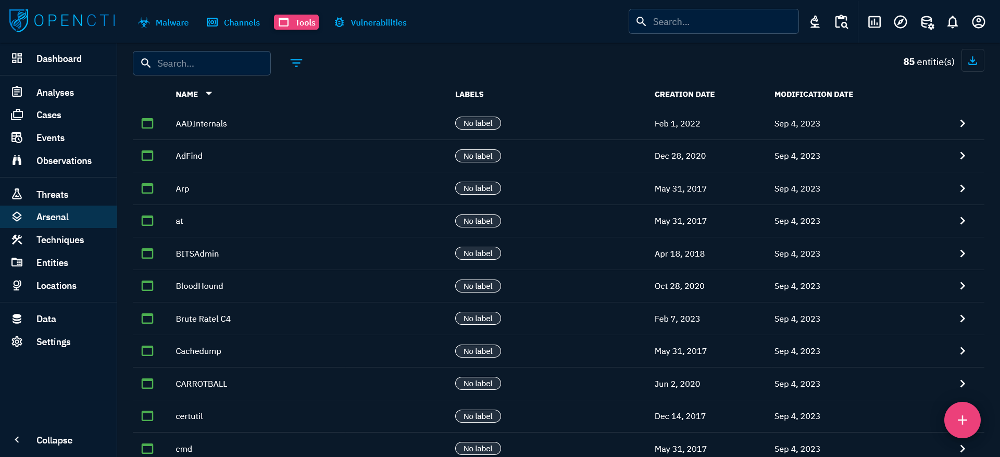

# Arsenal

When you click on "Arsenal" in the left-side bar, you access all the "Arsenal" tabs, visible on the top bar on the left. By default, the user directly access the "Malware" tab, but can navigate to the other tabs as well.

From the `Arsenal` section, users can access the following tabs:

- `Malware`: `Malware` represents any piece of code specifically designed to damage, disrupt, or gain unauthorized access to computer systems, networks, or user data.
- `Channels`: `Channels`, in the context of cybersecurity, refer to places or means through which actors disseminate information. This category is used in particular in the context of FIMI (Foreign Information Manipulation Interference). 
- `Tools`: `Tools` represent legitimate, installed software or hardware applications on an operating system that can be misused by attackers for malicious purposes. (e.g. LOLBAS).
- `Vulnerabilities`: `Vulnerabilities` are weaknesses or that can be exploited by attackers to compromise the security, integrity, or availability of a computer system or network.

## Malware

### General presentation

Malware encompasses a broad category of malicious pieces of code built, deployed, and operated by intrusion set. Malware can take many forms, including viruses, worms, Trojans, ransomware, spyware, and more. These entities are created by individuals or groups, including state-nations, state-sponsored groups, corporations, or hacktivist collectives.

Use the `Malware` SDO to model and track these threats comprehensively, facilitating in-depth analysis, response, and correlation with other security data.

When clicking on the Malware tab on the top left, you access the list of all the Malware you have access to, in respect with your [allowed marking definitions](../administration/users.md). These malware are displayed as **Cards** where you can find a summary of the important Knowledge associated with each of them: description, aliases, related intrusion sets, countries and sectors they target, and labels. You can then search and filter on some common and specific attributes of Malware.

At the top right of each Card, you can click the star icon to put it as favorite. It will pin the card on top of the list. You will also be able to display all your favorite easily in your [Custom Dashboards](dashboards.md).

### Visualizing Knowledge associated with a Malware

When clicking on an `Malware` card you land on its Overview tab. For a Malware, the following tabs are accessible:

- Overview: as described [here](overview.md#overview-section).
- Knowledge: a complex tab that regroups all the structured Knowledge linked to the Malware. Different thematic views are proposed to easily see the victimology, the threat actors and intrusion sets using the Malware, etc. As described [here](overview.md#knowledge-section).
- Analyses: as described [here](overview.md#analysis-section).
- Data: as described [here](overview.md#data-section).
- History: as described [here](overview.md#history-section).

## Channels

### General presentation

`Channels` - such as forums, websites and social media platforms (e.g. Twitter, Telegram) - are mediums for disseminating news, knowledge, and messages to a broad audience. While they offer benefits like open communication and outreach, they can also be leveraged for nefarious purposes, such as spreading misinformation, coordinating cyberattacks, or promoting illegal activities. 

Monitoring and managing content within `Channels` aids in analyzing threats, activities, and indicators associated with various threat actors, campaigns, and intrusion sets.

When clicking on the Channels tab at the top left, you access the list of all the Channels you have access to, in respect with your [allowed marking definitions](../administration/users.md). These channels are displayed in a list where you can find certain fields characterizing the entity: type of channel, labels, and dates. You can then search and filter on some common and specific attributes of Channels.

### Visualizing Knowledge associated with a Channel

When clicking on a `Channel` in the list, you land on its Overview tab. For a Channel, the following tabs are accessible:

- Overview: as described [here](overview.md#overview-section).
- Knowledge: a complex tab that regroups all the structured Knowledge linked to the Channel. Different thematic views are proposed to easily see the victimology, the threat actors and intrusion sets using the Malware, etc. As described [here](overview.md#knowledge-section).
- Analyses: as described [here](overview.md#analysis-section).
- Data: as described [here](overview.md#data-section).
- History: as described [here](overview.md#history-section).

## Tools

### General presentation

`Tools` refers to legitimate, pre-installed software applications, command-line utilities, or scripts that are present on a compromised system. These objects enable you to model and monitor the activities of these tools, which can be misused by attackers.

When clicking on the `Tools` tab at the top left, you access the list of all the `Tools` you have access to, in respect with your [allowed marking definitions](../administration/users.md). These tools are displayed in a list where you can find certain fields characterizing the entity: labels and dates. You can then search and filter on some common and specific attributes of Tools.

### Visualizing Knowledge associated with an Observed Data

When clicking on a `Tool` in the list, you land on its Overview tab. For a Tool, the following tabs are accessible:

- Overview: as described [here](overview.md#overview-section).
- Knowledge: a complex tab that regroups all the structured Knowledge linked to the Tool. Different thematic views are proposed to easily see the threat actors, the intrusion sets and the malware using the Tool. As described [here](overview.md#knowledge-section).
- Analyses: as described [here](overview.md#analysis-section).
- Data: as described [here](overview.md#data-section).
- History: as described [here](overview.md#history-section).

## Vulnerabilities

### General presentation

`Vulnerabilities` represent weaknesses or flaws in software, hardware, configurations, or systems that can be exploited by malicious actors. This object assists in managing and tracking the organization's security posture by identifying areas that require attention and remediation, while also providing insights into associated intrusion sets, malware and campaigns where relevant.

When clicking on the `Vulnerabilities` tab at the top left, you access the list of all the `Vulnerabilities` you have access to, in respect with your [allowed marking definitions](../administration/users.md). These vulnerabilities are displayed in a list where you can find certain fields characterizing the entity: CVSS3 severity, labels, dates and creators (in the platform). You can then search and filter on some common and specific attributes of Vulnerabilities.

### Visualizing Knowledge associated with an Observed Data

When clicking on a `Vulnerabilities` in the list, you land on its Overview tab. For a Vulnerability, the following tabs are accessible:

- Overview: as described [here](overview.md#overview-section).
- Knowledge: a complex tab that regroups all the structured Knowledge linked to the Vulnerability. Different thematic views are proposed to easily see the threat actors, the intrusion sets and the malware exploiting the Vulnerability. As described [here](overview.md#knowledge-section).
- Analyses: as described [here](overview.md#analysis-section).
- Data: as described [here](overview.md#data-section).
- History: as described [here](overview.md#history-section).