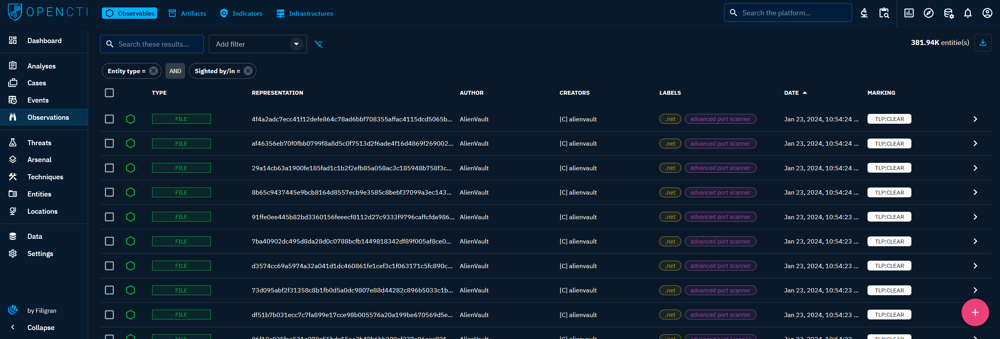
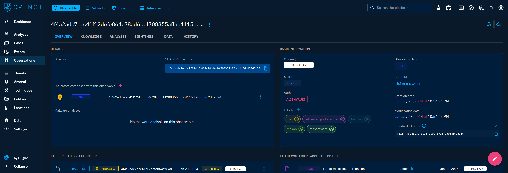
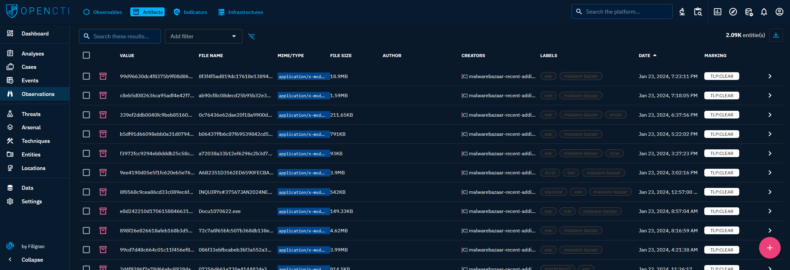
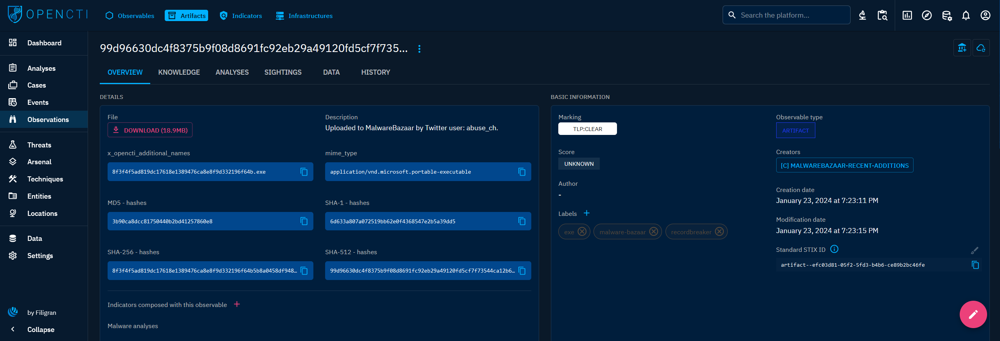
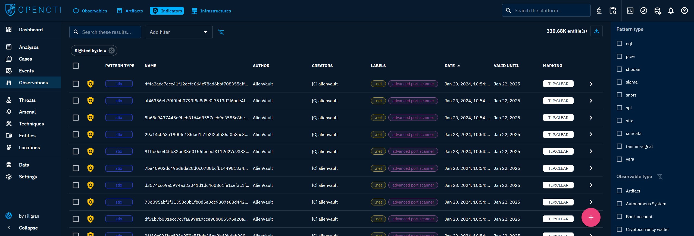

# Observations

When you click on "Observations" in the left-side bar, you access all the "Observations" tabs, visible on the top bar on the left. By default, the user directly access the "Observables" tab, but can navigate to the other tabs as well.

From the `Observations` section, users can access the following tabs:

- `Observables`: An `Observable` represents an immutable object. Observables can encompass a wide range of entities such as IPv4 addresses, domain names, email addresses, and more.
- `Artefacts`: In OpenCTI, the `Artefacts` is a particular Observable. It may contain a file, such as a malware sample.
- `Indicators`: An `Indicator` is a detection object. It is defined by a search pattern, which could be expressed in various formats such as STIX, Sigma, YARA, among others.
- `Infrastructures`: An `Infrastructure` describes any systems, software services and any associated physical or virtual resources intended to support some purpose (e.g. C2 servers used as part of an attack, devices or servers that are part of defense, database servers targeted by an attack, etc.).

## Observables

### General presentation

An Observable is a distinct entity from the Indicator within OpenCTI and represents an immutable object. Observables can encompass a wide range of entities such as IPv4 addresses, domain names, email addresses, and more. Importantly, Observables doesn't inherently imply malicious intent, they can include items like legitimate IP addresses or domains associated with an organization. Additionally, they serve as raw data points without the additional detection context found in Indicators.

When clicking on the Observables tab at the top left, you see the list of all the Observables you have access to, in respect with your [allowed marking definitions](../administration/users.md).

### Visualizing Knowledge associated with an Observable

When clicking on an `Observable` in the list, you land on its Overview tab. For an Observable, the following tabs are accessible:

- Overview: as described [here](overview.md#overview-section), with the particularity to display Indicators composed with the Observable.
- Knowledge: a tab listing all its relationships and [nested objects](nested.md).
- Analyses: as described [here](overview.md#analyses-section).
- Sightings: a table containing all `Sightings` relationships corresponding to events in which the `Observable` (IP, domain name, url, etc.) has been sighted.
- Data: as described [here](overview.md#data-section).
- History: as described [here](overview.md#history-section).

## Artefacts

### General presentation

An Artefact is a particular Observable. It may contain a file, such as a malware sample. Files can be uploaded or downloaded in encrypted archives, providing an additional layer of security against potential manipulation of malicious payloads.

When clicking on the Artefacts tab at the top left, you see the list of all the Artefacts you have access to, in respect with your [allowed marking definitions](../administration/users.md).

### Visualizing Knowledge associated with an Artefact

When clicking on an `Artefact` in the list, you land on its Overview tab. For an Artefact, the following tabs are accessible:

- Overview: as described [here](overview.md#overview-section), with the particularity to be able to download the attached file.
- Knowledge: a tab listing all its relationships and [nested objects](nested.md).
- Analyses: as described [here](overview.md#analyses-section).
- Sightings: a table containing all `Sightings` relationships corresponding to events in which the `Artefact` has been sighted.
- Data: as described [here](overview.md#data-section).
- History: as described [here](overview.md#history-section).

## Indicators

### General presentation

An Indicator is a detection object. It is defined by a search pattern, which could be expressed in various formats such as STIX, Sigma, YARA, among others. This pattern serves as a key to identify potential threats within the data. Furthermore, an Indicator includes additional information that enriches its detection context. This information encompasses:

- Validity dates: Indicators are accompanied by a time frame, specifying the duration of their relevance, and modeled by the `Valid from` and `Valid until` dates.
- Actionable fields: Linked to the validity dates, the `Revoked` and `Detection` fields can be used to sort Indicators for detection purposes.
- Kill chain phase: They indicate the phase within the cyber kill chain where they are applicable, offering insights into the progression of a potential threat.
- Types: Indicators are categorized based on their nature, aiding in classification and analysis.

When clicking on the Indicators tab at the top left, you see the list of all the Indicators you have access to, in respect with your [allowed marking definitions](../administration/users.md).

### Visualizing Knowledge associated with an Indicator

When clicking on an `Indicator` in the list, you land on its Overview tab. For an Indicator, the following tabs are accessible:

- Overview: as described [here](overview.md#overview-section), with the particularity to display the Observables on which it is based.
- Knowledge: a tab listing all its relationships.
- Analyses: as described [here](overview.md#analyses-section).
- Sightings: a table containing all `Sightings` relationships corresponding to events in which the `Indicator` has been sighted.
- Data: as described [here](overview.md#data-section).
- History: as described [here](overview.md#history-section).

## Infrastructures

### General presentation

An Infrastructure refers to a set of resources, tools, systems, or services employed by a threat to conduct their activities. It represents the underlying framework or support system that facilitates malicious operations, such as the command and control (C2) servers in an attack. Notably, like Observables, Infrastructure doesn't inherently imply malicious intent. It can also represent legitimate resources affiliated with an organization (e.g. devices or servers that are part of defense, database servers targeted by an attack, etc.).

When clicking on the Infrastructures tab at the top left, you see the list of all the Infrastructures you have access to, in respect with your [allowed marking definitions](../administration/users.md).

### Visualizing Knowledge associated with an Infrastructure

When clicking on an `Infrastructure` in the list, you land on its Overview tab. For an Infrastructure, the following tabs are accessible:

- Overview: as described [here](overview.md#overview-section), with the particularity to display distribution graphs of its related Observable (STIX SCO).
- Knowledge: a complex tab that regroups all the structured Knowledge linked to the Infrastructure. Different thematic views are proposed to easily see the threats, the arsenal, the observations, etc. linked to the Infrastructure. As described [here](overview.md#knowledge-section).
- Analyses: as described [here](overview.md#analyses-section).
- Data: as described [here](overview.md#data-section).
- History: as described [here](overview.md#history-section).

