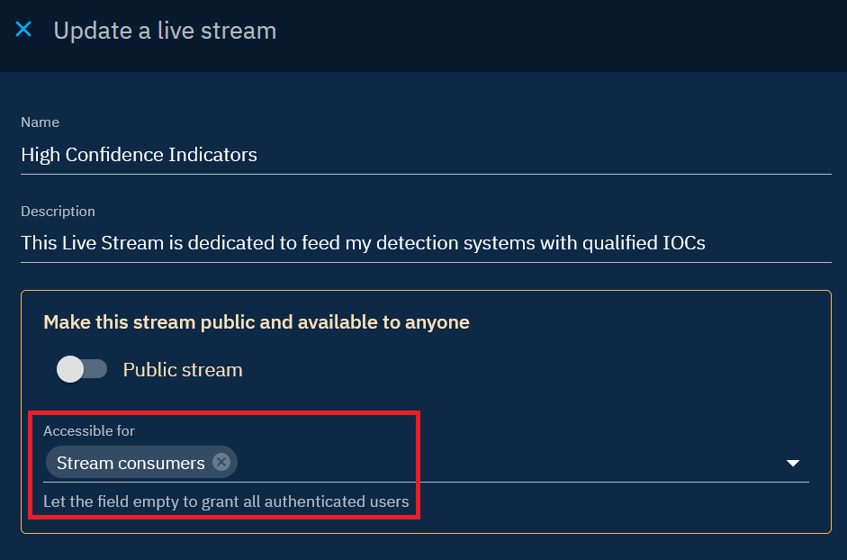
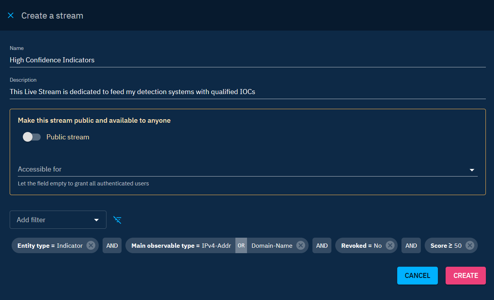
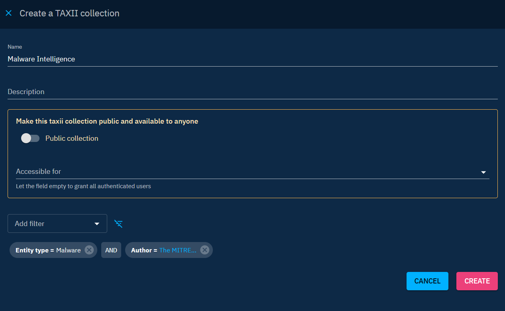

# Native feeds

OpenCTI provides versatile mechanisms for sharing data through its built-in feeds, including Live streams, TAXII collections, and CSV feeds.

## Feed configuration

Feeds are configured in the "Data > Data sharing" window. Configuration for all feed types is uniform and relies on the following parameters:

- Filter setup: The feed can have specific filters to publish only a subset of the platform overall knowledge. Any data that meets the criteria established by the user's feed filters will be shared (e.g. specific types of entities, labels, marking definitions, etc.).
- Access control: A feed can be either public, i.e. accessible without authentication, or restricted. By default, it's accessible to any user with the "Access data sharing" capability, but it's possible to increase restrictions by limiting access to a specific user, group, or organization.

By carefully configuring filters and access controls, you can tailor the behavior of Live streams, TAXII collections, and CSV feeds to align with your specific data-sharing needs.

## Live streams

### Introduction

Live streams, an exclusive OpenCTI feature, increase the capacity for real-time data sharing by serving STIX 2.1 bundles as TAXII collections with advanced capabilities. What distinguishes them is their dynamic nature, which includes the creation, updating, and deletion of data. Unlike TAXII, Live streams comprehensively resolve relationships and dependencies, ensuring a more nuanced and interconnected exchange of information. This is particularly beneficial in scenarios where sharing involves entities with complex relationships, providing a richer context for the shared data.

In scenarios involving data sharing between two OpenCTI platforms, Live streams emerge as the preferred mechanism. These streams operate like TAXII collections but are notably enhanced, supporting:

* create, update and delete events depending on the parameters,
* caching already created entities in the last 5 minutes,
* resolving relationships and dependencies even out of the filters,
* can be public (without authentication).

!!! warning "Resolve relationships and dependencies"

    Dependencies and relationships of entities shared via Live streams, as determined by specified filters, are automatically shared even beyond the confines of these filters. This means that interconnected data, which may not directly meet the filter criteria, is still included in the Live stream. However, OpenCTI data segregation mechanisms are still applied. They allow to restrict access to shared data based on factors such as markings or organization. It's imperative to carefully configure and manage these access controls to ensure that no confidential data is shared.

### Illustrative scenario

To better understand how live streams are working, let's take a few examples, from simple to complex.

Given a live stream with filters *Entity type: Indicator* `AND` *Label: detection*. Let's see what happens with an indicator with:

* Marking definition: `TLP:GREEN`
* Author `Crowdstrike`
* Relation `indicates` to the malware `Emotet`

| Action                          | Result in stream (with `Avoid dependencies resolution=true`)   | Result in stream (with `Avoid dependencies resolution=false`)                                                                    |
|:--------------------------------|:---------------------------------------------------------------|:---------------------------------------------------------------------------------------------------------------------------------|
| 1. Create an indicator          | Nothing                                                        | Nothing                                                                                                                          |
| 2. Add the label `detection`    | Create `TLP:GREEN`, create `CrowdStrike`, create the indicator | Create `TLP:GREEN`, create `CrowdStrike`, create the malware `Emotet`, create the indicator, create the relationship `indicates` |
| 3. Remove the label `detection` | Delete the indicator                                           | Delete the indicator and the relationship                                                                                        |
| 4. Add the label `detection`    | Create the indicator                                           | Create the indicator, create the relationship `indicates`                                                                        |
| 5. Delete the indicator         | Delete the indicator                                           | Delete the indicator  and the relationship                                                                                       |

Details on how to consume these Live streams can be found on [the dedicated page](import-automated.md).

## TAXII Collections

OpenCTI has an embedded TAXII API endpoint which provides valid STIX 2.1 bundles. If you wish to know more about the TAXII standard, [please read the official introduction](https://oasis-open.github.io/cti-documentation/taxii/intro.html).

In OpenCTI you can create as many TAXII 2.1 collections as needed. 

After creating a new collection, every system with a proper access token can consume the collection using different kinds of authentication (basic, bearer, etc.). 

As when using the GraphQL API, TAXII 2.1 collections have a classic pagination system that should be handled by the consumer. Also, it's important to understand that element dependencies (nested IDs) inside the collection are not always contained/resolved in the bundle, so consistency needs to be handled at the client level.

## CSV feeds

In OpenCTI, you can share data in the form of .CSV exports. This can be particularly useful if you don't wish to interconnect your OpenCTI instance with products dedicated to enrichment, dissemination or detection.

## Find the CSV Feeds feature

To find this feature in your instance, simply go to your platform's data area and Data sharing (Data → Data sharing → CSV Feeds).

On the right-hand side of your screen you'll see the three current possibilities for sharing data via Live streams, CSV Feeds or TAXII collections.

If you go to the CSV Feeds panel, you'll see all the CSV Feeds you've already created, along with a variety of information. You'll obviously find the name given to the CSV Feeds, the Entity Types supported by the functionality, the rolling time set by the feed creator, the names of the columns found in the .CSV file and, finally, the specific filters applied in the feed settings.

## Creating my feed

Clicking on the cross at bottom right opens the Create a feed panel.

Once you've given your feed a name and written a description, you can start defining the parameters.

### Distribution level

You can choose to make your feed public by checking the eponymous box. Once checked, this will make your feed public and therefore accessible to all.

If you wish to make it accessible only to a specific audience, you can also define who will be able to receive your feed; either one or several groups or organizations already defined in your platform.

### Rolling time

Rolling time is set in minutes. Its function is to return all objects corresponding to filters that have been updated within this range of minutes.

In concrete terms, this means that your .CSV document will contain only the data you require within the timeframe defined when the file was generated. If you set a rolling time of 24 hours, i.e. 1440 minutes, data dating back 1441 minutes or more will not appear in the file when it is generated.

### Base attribute

You must then choose the type of attribute to be taken into account by Rolling time. Either you choose to show only elements created in your Rolling time with the ‘Creation date’ attribute, or you choose to show only elements updated during this time with the ‘Update date’ attribute.

### Entity Types

Next, you need to define the entity type(s) you wish to follow. These are identical to those found elsewhere in the platform.

Once selected, you need to specify what you want to extract from the content of the defined entity types. To do this, you can add filters

In this example, we're looking inside the Artifact entities for the various hashes that have appeared, categorizing them according to several hashing methods over the last 1440 minutes (i.e. 24 hours).

Here we've also chosen to display the headers of each column, so that we can find in column A the MD5 hashes, in column B the SHA-1 hashes and in column C the SHA-256 hashes present in all the artifacts corresponding to the Rolling time.

### The final .CSV file

If the export has been properly configured, simply click on the CSV Feed that has just been created to open the file generation.

The resulting .CSV file will then contain all the MD5, SHA-1 and SHA-256 hashes in the columns defined with the separators that had been set.