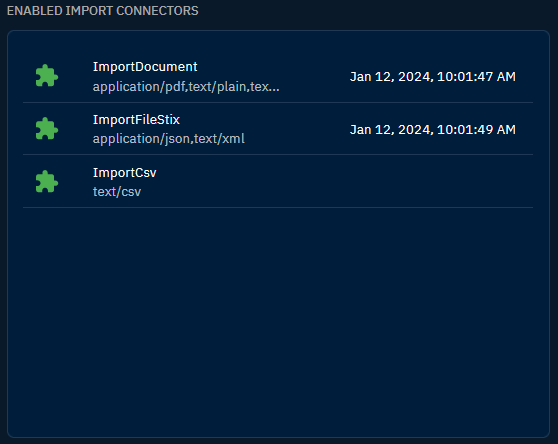

# Import from files

## Import mechanisms

The platform provides a seamless process for automatically parsing data from various file formats. This capability is facilitated by two distinct mechanisms.

**File import connectors:** Currently, there are two connectors designed for importing files and automatically identifying entities.

- `ImportFileStix`: Designed to handle STIX-structured files (json or xml format).
- `ImportDocument`: Versatile connector supporting an array of file formats, including pdf, text, html, and markdown.

**CSV mappers:** The CSV mapper is a tailored functionality to facilitate the import of data stored in CSV files. For more in-depth information on using CSV mappers, refer to the [CSV Mappers](../administration/csv-mappers.md) documentation page.

## Usage

### Locations

Both mechanisms can be employed wherever file uploads are possible. This includes the "Data" tabs of all entities and the dedicated panel named "Data import and analyst workbenches" located in the top right-hand corner (database logo with a small gear). Importing files from these two locations is not entirely equal; refer to the "Relationship handling from entity's Data tab" section below for details on this matter.

### Entity identification process

For `ImportDocument` connector, the identification process involves searching for existing entities in the platform and scanning the document for relevant information. In additions, the connector use regular expressions (regex) to detect IP addresses and domains within the document.

As for the `ImportFileStix` connector and the CSV mappers, there is no identification mechanism. The imported data will be, respectively, the data defined in the STIX bundle or according to the configuration of the CSV mapper used.

### Workflow overview

1. Upload file: Navigate to the desired location, such as the "Data" tabs of an entity or the "Data import and analyst workbenches" panel. Then, upload the file containing the relevant data by clicking on the small cloud with the arrow inside next to "Uploaded files".
2. Entity identification: For a CSV file, select the connector and CSV mapper to be used by clicking on the icon with an upward arrow in a circle. If it's not a CSV file, the connector will launch automatically. Then, the file import connectors or CSV mappers will identify entities within the uploaded document.
3. Workbench review and validation: Entities identified by connectors are not immediately integrated into the platform's knowledge base. Instead, they are thoughtfully placed in a workbench, awaiting review and validation by an analyst. Workbenches function as draft spaces, ensuring that no data is officially entered into the platform until the workbench has undergone the necessary validation process. For more information on workbenches, refer to the [Analyst workbench](workbench.md) documentation page.

!!! warning "Review workbenches"

    Import connectors may introduce errors in identifying object types or add "unknown" entities. Workbenches were established with the intent of reviewing the output of connectors before validation. Therefore, it is crucial to be vigilant when examining the workbench to prevent the import of incorrect data into the platform.

## Additional information

### No workbench for CSV mapper

It's essential to note that CSV mappers operate differently from other import mechanisms. Unlike connectors, CSV mappers do not generate workbenches. Instead, the data identified by CSV mappers is imported directly into the platform without an intermediary workbench stage.

### Relationship handling from entity's "Data" tab

When importing a document directly from an entity's "Data" tab, there can be an automatic addition of relationships between the objects identified by connectors and the entity in focus. The process differs depending on the type of entity in which the import occurs:

- If the entity is a container (e.g., Report, Grouping, and Cases), the identified objects in the imported file will be linked to the entity (upon workbench validation). In the context of a container, the object is said to be "contained".
- For entities that are not containers, a distinct behavior unfolds. In this scenario, the identified objects are not linked to the entity, except for Observables. `Related to` relationships between the Observables and the entity are automatically added to the workbench and created after validation of this one.

### File import in Content tab

Expanding the scope of file imports, users can seamlessly add files in the `Content` tab of [Analyses](exploring-analysis.md) or [Cases](exploring-cases.md). In this scenario, the file is directly added as an attachment without utilizing an import mechanism.

### User capability requirement

In order to initiate file imports, users must possess the requisite [capability](../administration/users.md): "Upload knowledge files." This capability ensures that only authorized users can contribute and manage knowledge files within the OpenCTI platform, maintaining a controlled and secure environment for data uploads.

!!! warning "Deprecation warning"

    Using the `ImportDocument` connector to parse CSV file is now disallowed as it produces inconsistent results.
    Please configure and use [CSV mappers](../administration/csv-mappers.md) dedicated to your specific CSV content for a reliable parsing.
    CSV mappers can be created and configured in the administration interface.   
