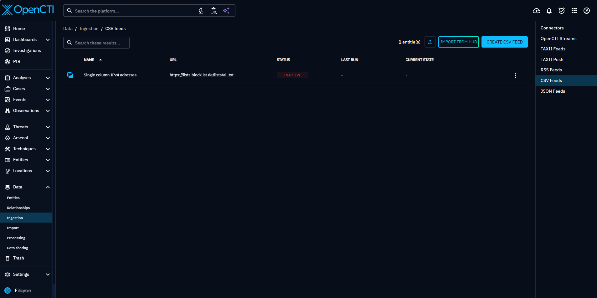
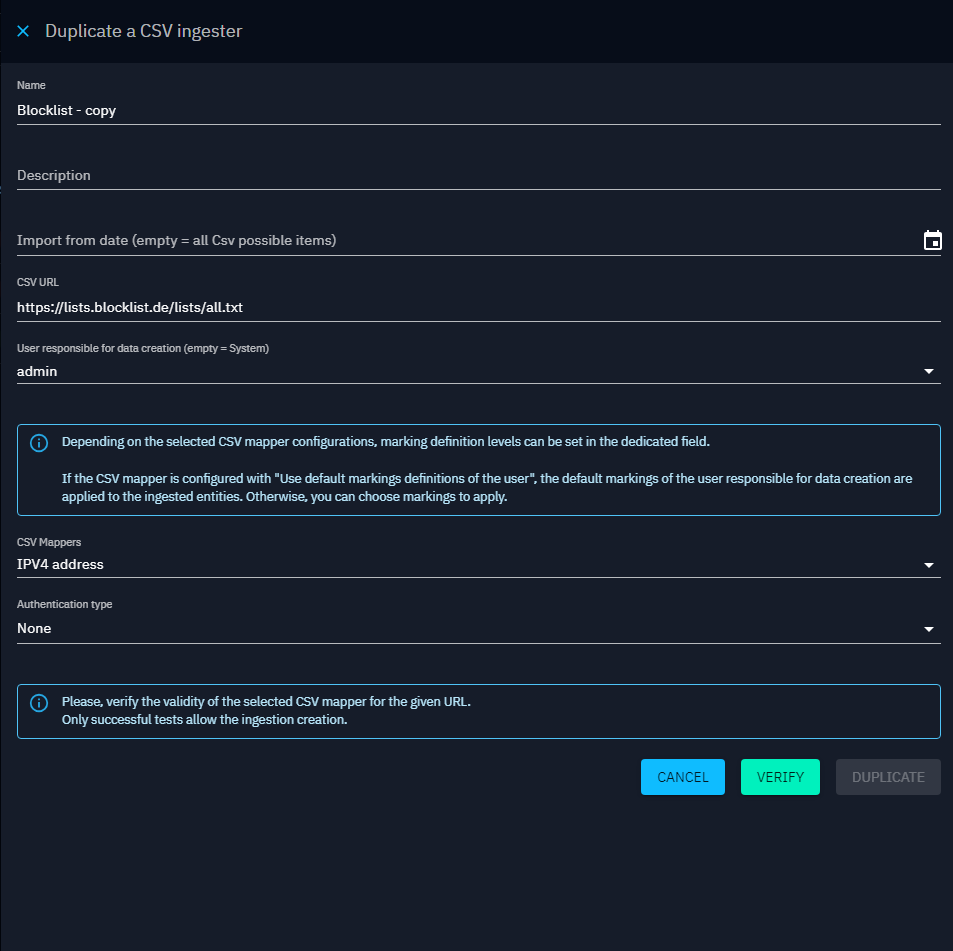

# CSV Feeds

CSV feed ingester enables users to import CSV files exposed on URLs.

## Best practices

In OpenCTI, the "Data > Ingestion" section provides users with built-in functions for automated data import. These functions are designed for specific purposes and can be configured to seamlessly ingest data into the platform. Here, we'll explore the configuration process for the five built-in functions: Live Streams, TAXII Feeds, TAXII Push, RSS Feeds, and JSON/CSV Feeds.

Ensuring a secure and well-organized environment is paramount in OpenCTI. Here are two recommended best practices to enhance security, traceability, and overall organizational clarity:

1. Create a dedicated user for each source: Generate a user specifically for feed import, following the convention `[F] Source name` for clear identification. Assign the user to the "Connectors" group to streamline user management and permission related to data creation. Please [see here](../../deployment/connectors.md#connector-token-section) for more information on this good practice.
2. Establish a dedicated Organization for the source: Create an organization named after the data source for clear identification. Assign the newly created organization to the "Default author" field in feed import configuration if available.

By adhering to these best practices, you ensure independence in managing rights for each import source through dedicated user and organization structures. In addition, you enable clear traceability to the entity's creator, facilitating source evaluation, dashboard creation, data filtering and other administrative tasks.

## Configuration

Here's a step-by-step guide to configure CSV ingesters:

1. CSV URL: Provide the URL of the CSV file exposed from which items will be imported.
2. CSV Mappers: Choose the CSV mapper to be used to import the data.
3. Authentication type (if necessary): Enter the authentication type.

!!! note "CSV mapper"

    CSV feed functionality is based on CSV mappers. It is necessary to create the appropriate CSV mapper to import the data contained in the file. See the page dedicated to the [CSV mapper](../administration/csv-mappers.md).

Additional configuration options:

- User responsible for data creation: Define the user responsible for creating data received from this CSV feed. Best practice is to dedicate one user per source for organizational clarity. Please [see the section "Best practices" below](../import-automated.md#best-practices-section) for more information.
- Import from date: Specify the date of the oldest data to retrieve. Leave the field empty to import everything.

in CSV Mappers, if you created a representative for Marking definition, you could have chosen between 2 options:

- let the user choose  marking definitions
- Use default marking definitions of the user

This configuration applies when using a CSV Mapper for a CSV Ingester. If you select a CSV Mapper containing the option "Use default marking definitions of the user", the default marking definitions of the user you chose to be responsible for the data creation will be applied to all data imported. If you select a CSV Mapper containing the option "let the user choose  marking definitions", you will be presented with the list of all the marking definitions of the user you chose to be responsible for the data creation (and not yours!)

To finalize the creation, click on "Verify" to run a check on the submitted URL with the selected CSV mapper. A valid URL-CSV mapper combination results in the identification of up to 50 entities.

To start your new ingester, click on "Start", in the burger menu.

CSV feed ingestion is made possible thanks to the connector "ImportCSV". So you can track the progress in "Data > Ingestion > Connectors". On a regular basis, the ingestion is updated when new data is added to the CSV feed.

## Duplicate a CSV feed ingester

If you need to modify your previous configuration which is already activated, we recommend to duplicate the CSV feed using the duplicate option in the burger button.

As you see, when you duplicate the CSV feed, the fields are pre-filled but you can change any of them. We advice you to keep the name with '-copy' to signify the origin of the duplicate feed.

As you see previously, you need to verify your CSV configuration before validating your form. Finally, you need to click on start to launch your new ingester.

