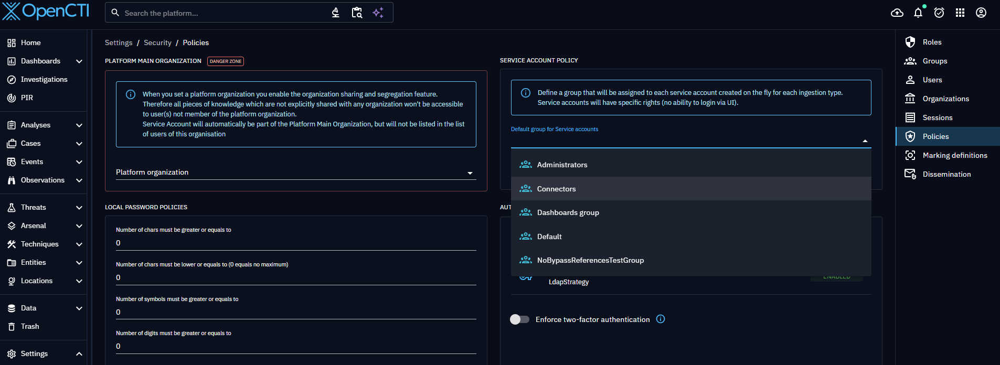
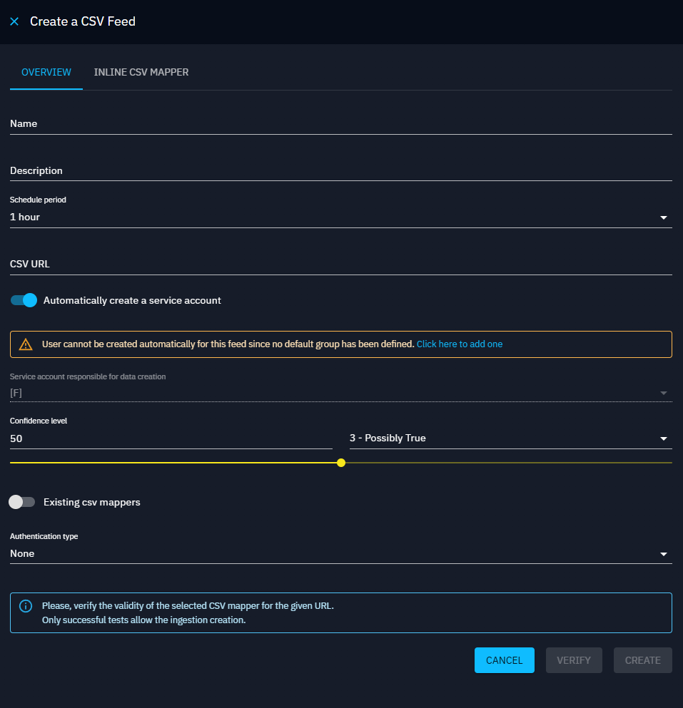
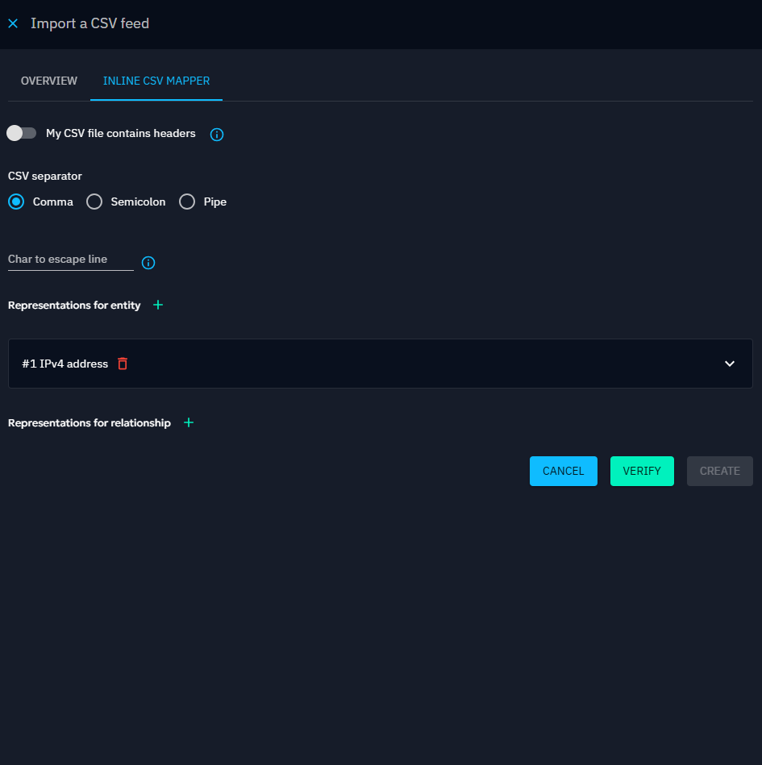
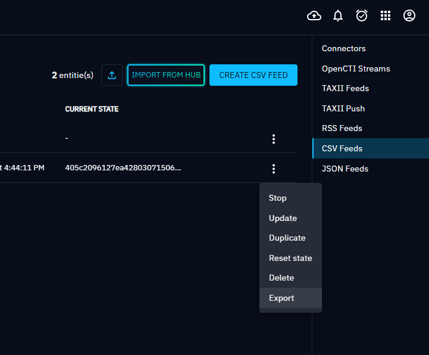
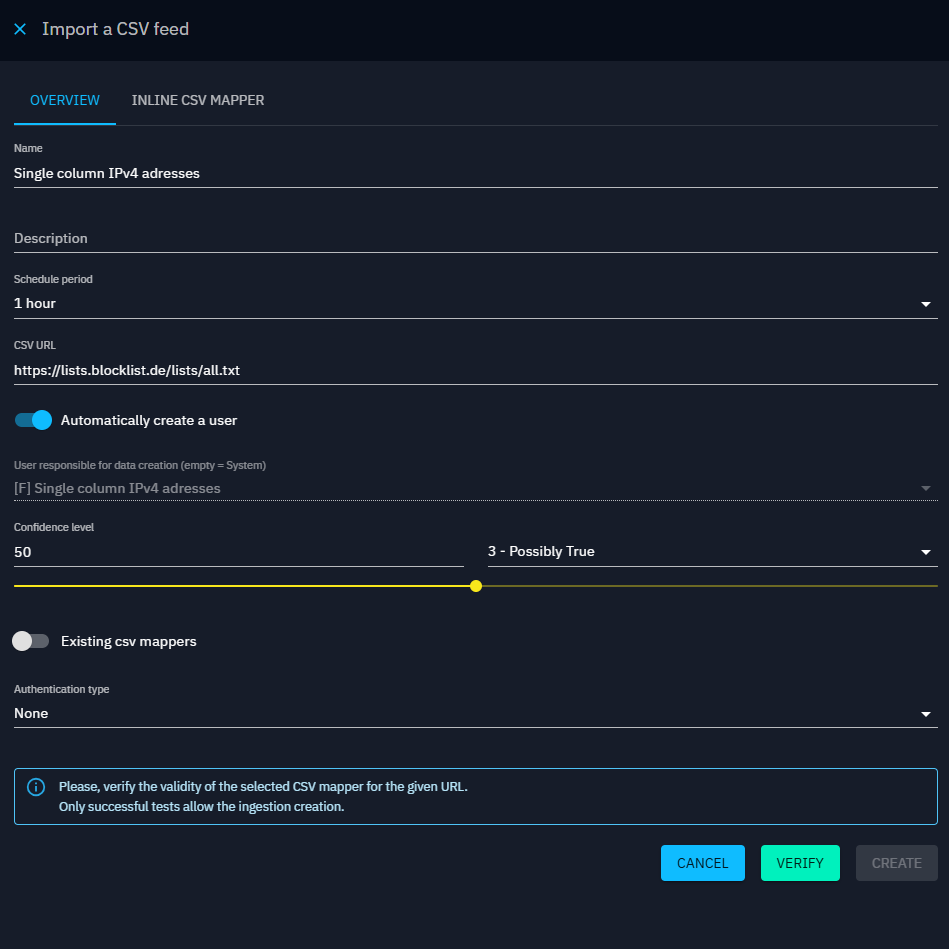

# CSV Feeds

CSV feed ingester enables users to import CSV files exposed on URLs.

<a id="best-practices-section"></a>
## Best practices

In OpenCTI, the "Data > Ingestion" section provides users with built-in functions for automated data import. These functions are designed for specific purposes and can be configured to seamlessly ingest data into the platform. Here, we'll explore the configuration process for the five built-in functions: Live Streams, TAXII Feeds, TAXII Push, RSS Feeds, and JSON/CSV Feeds.

Ensuring a secure and well-organized environment is paramount in OpenCTI. Here are two recommended best practices to enhance security, traceability, and overall organizational clarity:

1. Create a dedicated user for each source: Generate a user specifically for feed import, following the convention `[F] Source name` for clear identification. Assign the user to the "Connectors" group to streamline user management and permission related to data creation. Please [see here](../../deployment/connectors.md#connector-token-section) for more information on this good practice.
2. Establish a dedicated Organization for the source: Create an organization named after the data source for clear identification. Assign the newly created organization to the "Default author" field in feed import configuration if available.

By adhering to these best practices, you ensure independence in managing rights for each import source through dedicated user and organization structures. In addition, you enable clear traceability to the entity's creator, facilitating source evaluation, dashboard creation, data filtering and other administrative tasks.

Under Settings > Policies, you can now define a default group for the ingestion user, allowing you to create a specific user when setting up the CSV Feed.



## Configuration

Here's a step-by-step guide to configure Csv Feeds:

1. CSV URL: Provide the URL of the CSV file exposed from which items will be imported.
2. Configure Your CSV Mapper
    1. Create a CSV mapper on the fly by clicking "Inline CSV Mapper."
    2. Select the CSV mapper you want to use for data import.
3. Authentication Type (if required): Specify the authentication method to be used.
4. Scheduling Interval: Choose how often the feed should run. By default, this is set to 1 hour.

!!! note "CSV mapper"

    CSV feed functionality is based on CSV mappers. It is necessary to create the appropriate CSV mapper to import the data contained in the file. See the page dedicated to the [CSV mapper](../administration/csv-mappers.md).

Additional configuration options:

- User responsible for data creation: Define the user responsible for creating data received from this CSV feed. Best practice is to dedicate one user per source for organizational clarity by clicking on "Create automatic user". The name is not editable (unless you change the feed's name) but you must define a confidence level (between 0 and 100) to set this confidence to the user that will be automatically created. _Important_ : before clicking on "Create automatic user" you must define a default group for ingestion users, in the Settings part.
- Description



In CSV Mappers, if you created a representative for Marking definition, you could have chosen between 2 options:

- Use default marking definitions of the user by default on creation
- Let the user choose marking definitions




To finalize the creation, click on "Verify" to run a check on the submitted URL with the selected CSV mapper. A valid URL-CSV mapper combination results in the identification of up to 50 entities.


To start your new ingester, click on "Start", in the burger menu.


CSV feed ingestion is made possible thanks to the connector "ImportCSV". So you can track the progress in "Data > Ingestion > Connectors". On a regular basis, the ingestion is updated when new data is added to the CSV feed.


## Duplicate a CSV feed ingester

If you need to modify your previous configuration which is already activated, we recommend to duplicate the CSV feed using the duplicate option in the burger button.


As you see, when you duplicate the CSV feed, the fields are pre-filled but you can change any of them. We advice you to keep the name with '-copy' to signify the origin of the duplicate feed.


As you see previously, you need to verify your CSV configuration before validating your form. Finally, you need to click on start to launch your new ingester.


## Export a CSV feed

You can export your existing CSV feed from the platform, making it easy to share your configuration with others.

To export your ingester, click on "Export", in the burger menu.


Note: When exporting a CSV feed linked to a CSV Mapper ID, the configuration will be inlined directly within the file. This means that when you import it again, it will appear under the "Inline CSV Mapper" tabs.

## Import a CSV feed ingester

If you have a JSON CSV feed file you can import it by clicking on the icon next to "Import from hub"


When you click, you can select the desired file. After that, a drawer will open with the form pre-filled with the relevant information.
If necessary, configure the authentication type. By default, a user is already provided.



As you see previously, you need to verify your CSV configuration before validating your form. Finally, you need to click on start to launch your new ingester.


You can select CSV Feeds from the XTM Hub by clicking the ```Import from Hub``` button

#### One-click CSV Feed deployment
From the XTM Hub, you can effortlessly deploy your desired CSV Feed with just a single click.
To get started, simply register your OpenCTI platform following the instructions in our Registration documentation here: XXX (this documentation is on the XTM Hub project).
Next, navigate to your preferred CSV Feed and click the ```Deploy in OpenCTI``` button located in the top right corner.
If you have multiple OpenCTI platforms registered, choose the platform where you wish to deploy the CSV Feed.
You will then be redirected to the OpenCTI platform, where the process will proceed automatically.
Within a few seconds, you'll be directed to your newly created CSV Feed.

_Make sure you have the capability to create a CSV Feed on OpenCTI_

