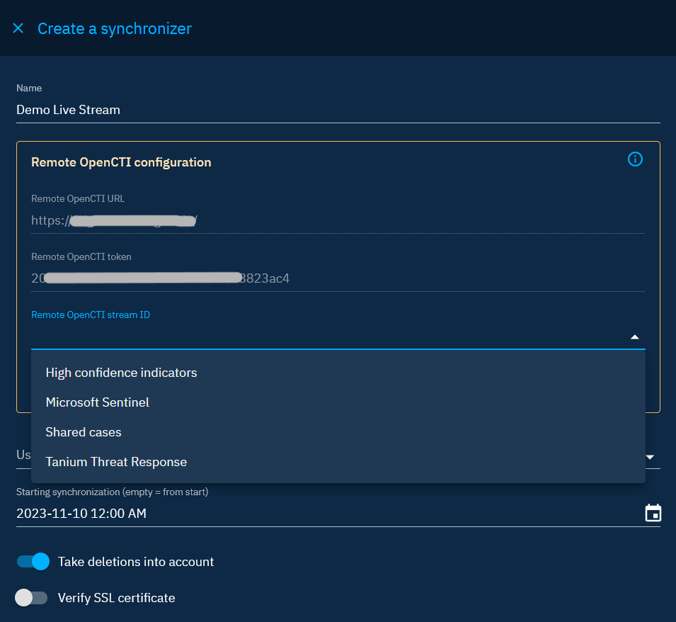
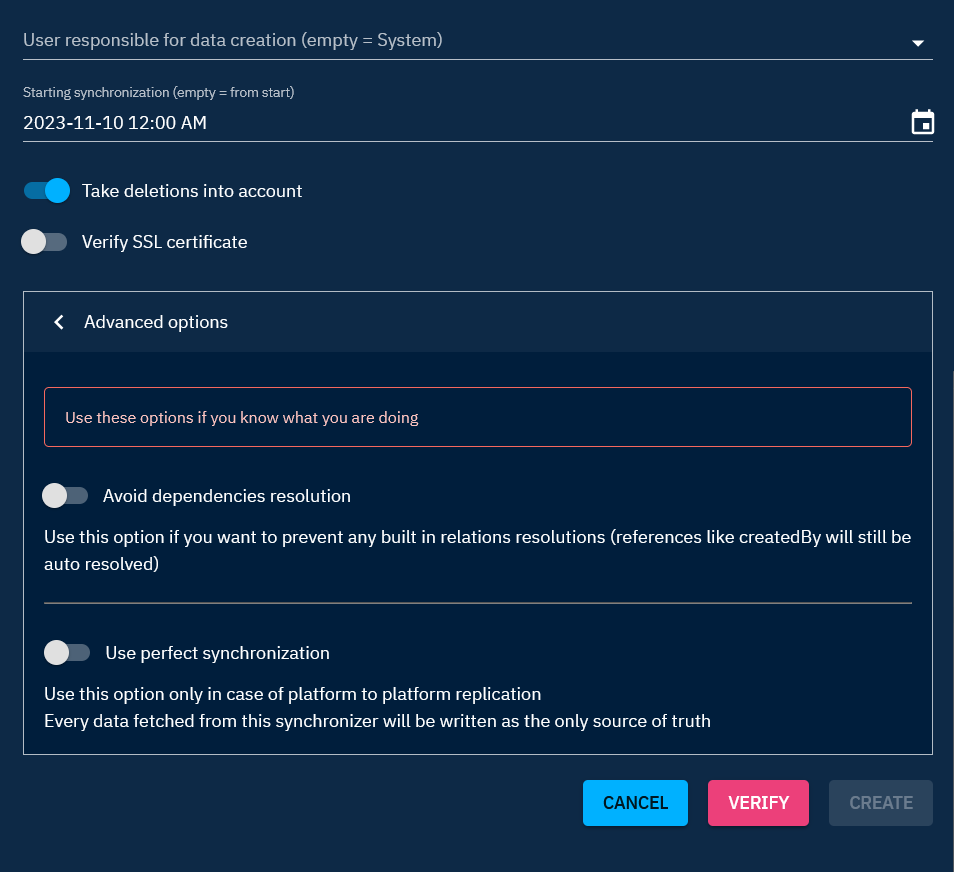

# Internal streams

Live Streams enable users to consume data from another OpenCTI platform, fostering collaborative intelligence sharing.

## Best practices

In OpenCTI, the "Data > Ingestion" section provides users with built-in functions for automated data import. These functions are designed for specific purposes and can be configured to seamlessly ingest data into the platform. Here, we'll explore the configuration process for the five built-in functions: Live Streams, TAXII Feeds, TAXII Push, RSS Feeds, and CSV/JSON Feeds.

Ensuring a secure and well-organized environment is paramount in OpenCTI. Here are two recommended best practices to enhance security, traceability, and overall organizational clarity:

1. Create a dedicated user for each source: Generate a user specifically for feed import, following the convention `[F] Source name` for clear identification. Assign the user to the "Connectors" group to streamline user management and permission related to data creation. Please [see here](../../deployment/connectors.md#connector-token-section) for more information on this good practice.
2. Establish a dedicated Organization for the source: Create an organization named after the data source for clear identification. Assign the newly created organization to the "Default author" field in feed import configuration if available.

By adhering to these best practices, you ensure independence in managing rights for each import source through dedicated user and organization structures. In addition, you enable clear traceability to the entity's creator, facilitating source evaluation, dashboard creation, data filtering and other administrative tasks.

## Configuration

Live Streams enable users to consume data from another OpenCTI platform, fostering collaborative intelligence sharing. Here's a step-by-step guide to configure Live streams synchroniser:

1. Remote OpenCTI URL: Provide the URL of the remote OpenCTI platform (e.g., `https://[domain]`; don't include the path).
2. Remote OpenCTI token: Provide the user token. An administrator from the remote platform must supply this token, and the associated user must have the "Access data sharing" privilege.
3. After filling in the URL and user token, validate the configuration.
4. Once validated, select a live stream to which you have access.

Additional configuration options:

- User responsible for data creation: Define the user responsible for creating data received from this stream. Best practice is to dedicate one user per source for organizational clarity. Please [see the section "Best practices" below](../getting-started.md) for more information.
- Starting synchronization: Specify the date of the oldest data to retrieve. Leave the field empty to import everything.
- Take deletions into account: Enable this option to delete data from your platform if it was deleted on the providing stream. (Note: Data won't be deleted if another source has imported it previously.)
- Verify SSL certificate: Check the validity of the certificate of the domain hosting the remote platform.
- Avoid dependencies resolution: Import only entities without their relationships. For instance, if the stream shares malware, all the malware's relationships will be retrieved by default. This option enables you to choose not to recover them.
- Use perfect synchronization: This option is specifically for synchronizing two platforms. If an imported entity already exists on the platform, the one from the stream will overwrite it.

