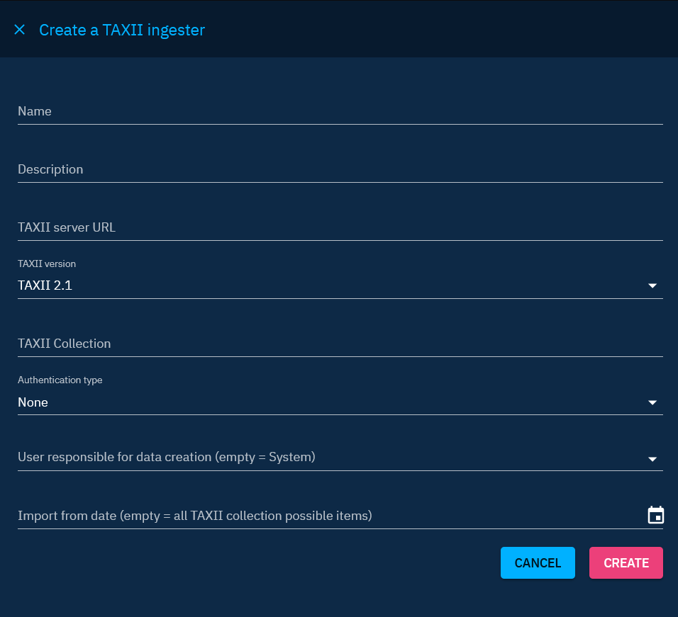

# TAXII Feeds

TAXII Feeds in OpenCTI provide a robust mechanism for ingesting TAXII collections from TAXII servers or other OpenCTI instances.

## Best practices

In OpenCTI, the "Data > Ingestion" section provides users with built-in functions for automated data import. These functions are designed for specific purposes and can be configured to seamlessly ingest data into the platform. Here, we'll explore the configuration process for the five built-in functions: Live Streams, TAXII Feeds, TAXII Push, RSS Feeds, and JSON/CSV Feeds.

Ensuring a secure and well-organized environment is paramount in OpenCTI. Here are two recommended best practices to enhance security, traceability, and overall organizational clarity:

1. Create a dedicated user for each source: Generate a user specifically for feed import, following the convention `[F] Source name` for clear identification. Assign the user to the "Connectors" group to streamline user management and permission related to data creation. Please [see here](../../deployment/connectors.md#connector-token-section) for more information on this good practice.
2. Establish a dedicated Organization for the source: Create an organization named after the data source for clear identification. Assign the newly created organization to the "Default author" field in feed import configuration if available.

By adhering to these best practices, you ensure independence in managing rights for each import source through dedicated user and organization structures. In addition, you enable clear traceability to the entity's creator, facilitating source evaluation, dashboard creation, data filtering and other administrative tasks.

## Configuration

Here's a step-by-step guide to configure TAXII ingesters:

1. TAXII server URL: Provide the root API URL of the TAXII server. For collections from another OpenCTI instance, the URL is in the form `https://[domain]/taxii2/root`.
2. TAXII collection: Enter the ID of the TAXII collection to be ingested. For collections from another OpenCTI instance, the ID follows the format `426e3acb-db50-4118-be7e-648fab67c16c`.
3. Authentication type (if necessary): Enter the authentication type. For non-public collections from another OpenCTI instance, the authentication type is "Bearer token." Enter the token of a user with access to the collection (similar to the point 2 of the Live streams configuration above).

!!! note "TAXII root API URL"

    Many ISAC TAXII configuration instructions will provide the URL for the collection or discovery service. In these cases, remove the last path segment from the TAXII Server URL in order to use it in OpenCTI. eg. use https://[domain]/tipapi/tip21, and not https://[domain]/tipapi/tip21/collections.

Additional configuration options:

- User responsible for data creation: Define the user responsible for creating data received from this TAXII feed. Best practice is to dedicate one user per source for organizational clarity. Please [see the section "Best practices" below](../import-automated.md#best-practices-section) for more information.
- Import from date: Specify the date of the oldest data to retrieve. Leave the field empty to import everything.

