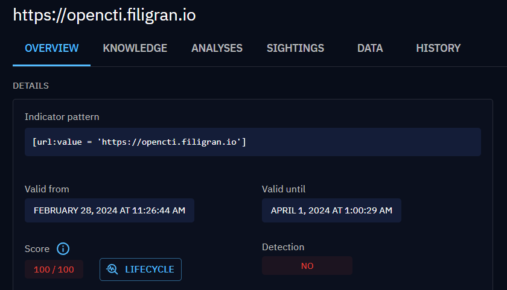
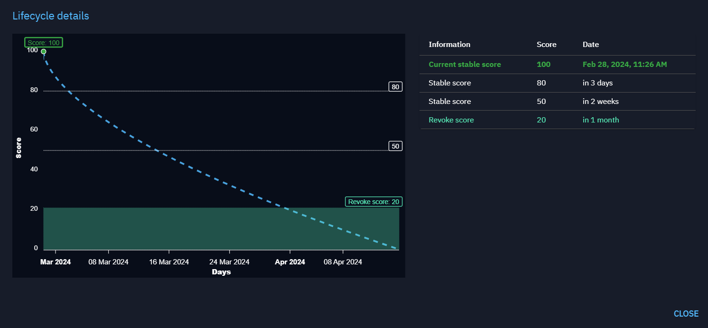

# Indicators Lifecycle Management

## Introduction

OpenCTI enforces strict rules to determine the period during which an indicator is effective for usage. This period is defined by the `valid_from` and `valid_until` dates. All along its lifecycle, the indicator `score` will decrease according to [configured decay rules](../administration/decay-rules.md). After the indicator expires, the object is marked as `revoked` and the `detection` field is automatically set to `false`. Here, we outline how these dates are calculated within the OpenCTI platform and how the score is updated with decay rules.

### Decay rule is selected on indicator creation

When a indicator is created on the platform, the decay engine search for the rule that applies at the time the indicator is created. This decay rule is stored along with the indicator: it means that only new indicator created are impacted when decay rules are changed or created.

## Setting validity dates

### Data source provided the dates

If a data source provides `valid_from` and `valid_until` dates and he indicator is elligible to be managed by a decay rule, the platform will change this valid_until with the one calculated by the Decay rule.

When an indicator is created as already revoked, the decay rule is not computed.

### Fallback rules for unspecified dates

If a data source does not provide validity dates, OpenCTI applies the decay rule matching the indicator to determine these dates.
The `valid_until` date is computed based on the revoke score of the decay rule : it is set at the exact time at which the indicator will reach the revoke score.
Past `valid_until` date, the indicator is marked as revoked.

## Score decay

Indicators have an initial score at creation, either provided by data source, or 50 by default.
Over time, this score is going to decrease according to the configured decay rules.
Score is updated at each reaction point defined for the decay rule matching the indicator at creation.

## Example

This URL indicator has matched the `Built-in IP and URL` decay rule. Its initial score at creation is 100. 

Right next to the indicator score, there is a button `Lifecycle` which enables to open a dialog to see the details of the indicator's lifecyle.

## How the decay behave on indicator updates

The decay rule is a mathematical computation based on:
- valid from
- indicator score
- being revoked or not

An update can occurs either on an actual update, or if an indicator is already existing in the platform in that case it's called an upsert.

### Upating score

Updating score restarts a decay lifecycle computation with the decay rule that is already stored in the indicator. It means that the valid until date is updated along with a score update.

### Updating the revoke state

- Updating an indicator and **moving revoked to true**: means that the decay manager will ignore the indicator. The score is automatically updated to be au maximum the revoke score of the decay rule that applies, or zero if no decay rules applies.

- Updating an indicator and **moving revoked to false**: means that the indicator must be valid given the decay lifecycle. If there is no score update along with the revoke update, the score is automatically updated to be the score at indicator creation, or if there is no decay rule 50. The valid until is then computed with this new score value.

### Managing concurency updates from distinct sources

In some case, several sources have different values for one given indicator and keep erasing each other score. As all decay data is computed everytime a score is change, there is a circuit breaker:
- if a source has already done an update with same score in the indicator life, the update is ignored.

## Conclusion

Understanding how OpenCTI calculates validity periods and scores is essential for effective threat intelligence analysis. These rules ensure that your indicators are accurate and up-to-date, providing a reliable foundation for threat intelligence data.

## Related reading:

- [Indicator decay manager](../deployment/managers.md)
- [Decay rules configuration](../administration/decay-rules.md)