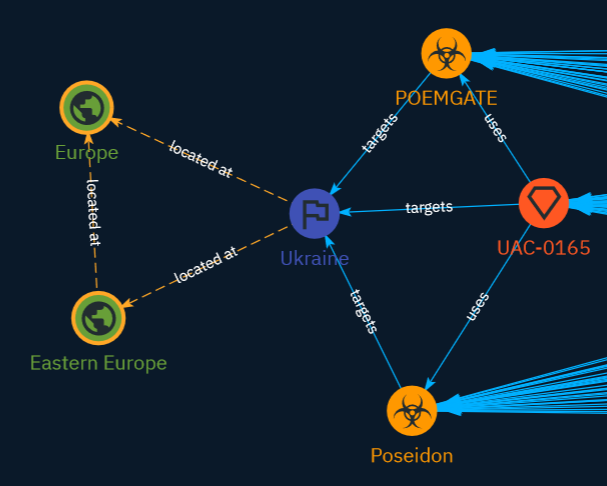

# Inferences and reasoning

## Overview

OpenCTI’s inferences and reasoning capability is a robust engine that automates the process of relationship creation within your threat intelligence data. This capability, situated at the core of OpenCTI, allows logical rules to be applied to existing relationships, resulting in the automatic generation of new, pertinent connections.

## Understanding inferences and reasoning

Inferences and reasoning serve as OpenCTI’s intelligent engine. It interprets your data logically. By activating specific predefined rules (of which there are around twenty), OpenCTI can deduce new relationships from the existing ones. For instance, if there's a connection indicating an Intrusion Set targets a specific country, and another relationship stating that this country is part of a larger region, OpenCTI can automatically infer that the Intrusion Set also targets the broader region.

## Key benefits

- Efficiency: Reduces manual workload by automating relationship creation, saving valuable analyst time.
- Completeness: Fills relationship gaps, ensuring a comprehensive and interconnected threat intelligence database.
- Accuracy: Minimizes manual input errors by deriving relationships from predefined, accurate logic.

## How it operates

When you activate an inference rule, OpenCTI continuously analyzes your existing relationships and applies the defined logical rules. These rules are logical statements that define conditions for new relationships. When the set of conditions is met, the OpenCTI creates the corresponding relationship automatically.

For example, if you activate a rule as follows:

IF [Entity A targets Identity B] AND [Identity B is part of Identity C]
THEN [Entity A targets Identity C]

OpenCTI will apply this rule to existing data. If it finds an Intrusion Set ("Entity A") targeting a specific country ("Identity B") and that country is part of a larger region ("Identity C"), the platform will automatically establish a relationship between the Intrusion Set and the region.

## Identifying inferred relationships

**In the knowledge graphs:** Inferred relationships are represented by dotted lines of a different color, distinguishing them from non-inferred relations.

**In the lists:** In a relationship list, a magic wand icon at the end of the line indicates relationship created by inference.

## Additional resources

- **Administration:** To find out about existing inference rules and enable/disable them, refer to the [Rules engine](../administration/reasoning.md) page in the Administration section of the documentation.
- **Playbooks:** [OpenCTI playbooks](automation.md) are highly customizable automation scenarios. This seamless integration allows for further automation, making your threat intelligence processes even more efficient and tailored to your specific needs. More information in our [blog post](https://blog.filigran.io/introducing-threat-intelligence-automation-and-playbooks-in-opencti-b9e2f9483aba).
