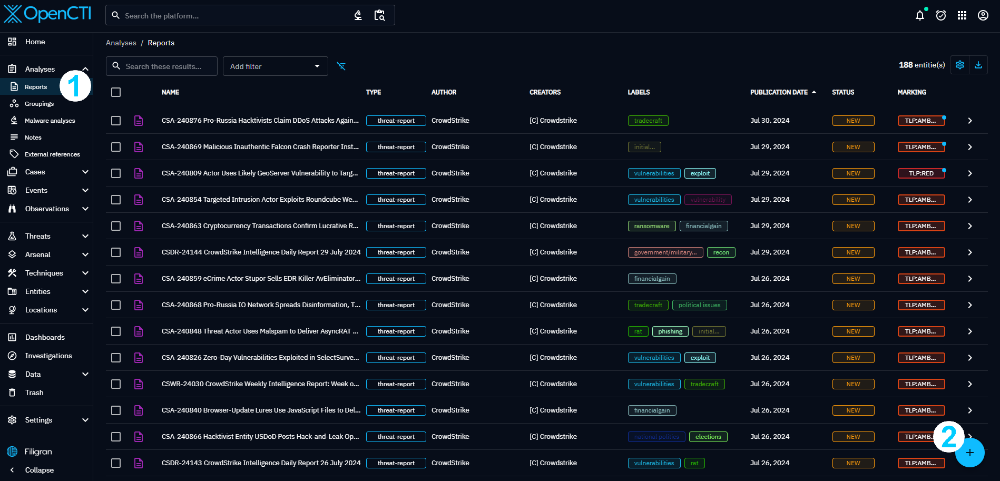
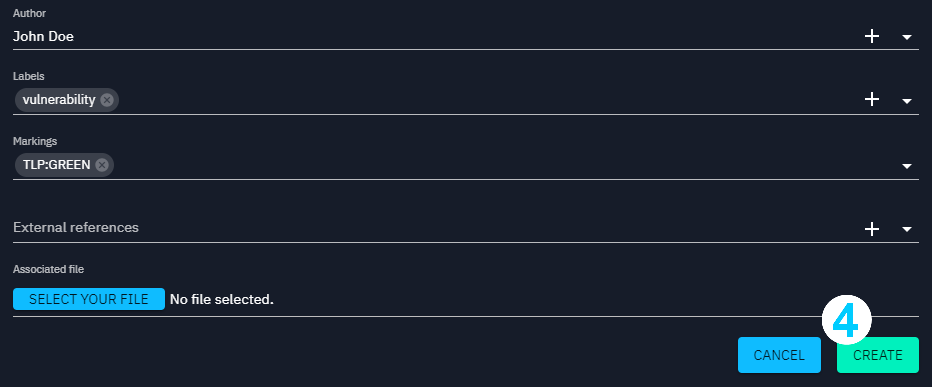
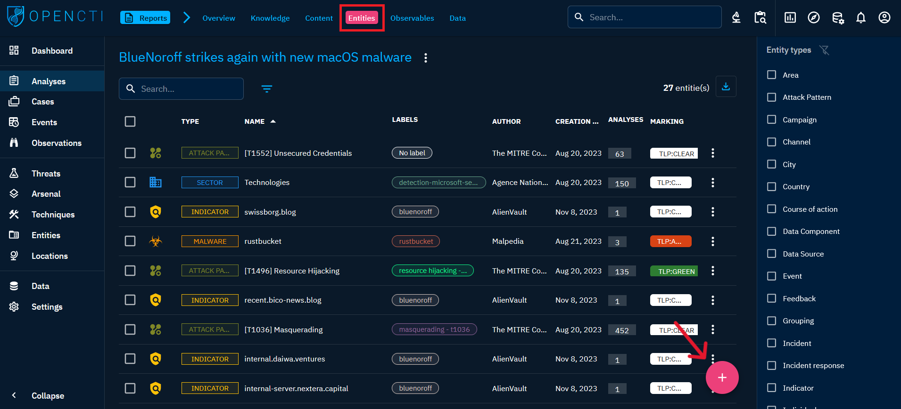
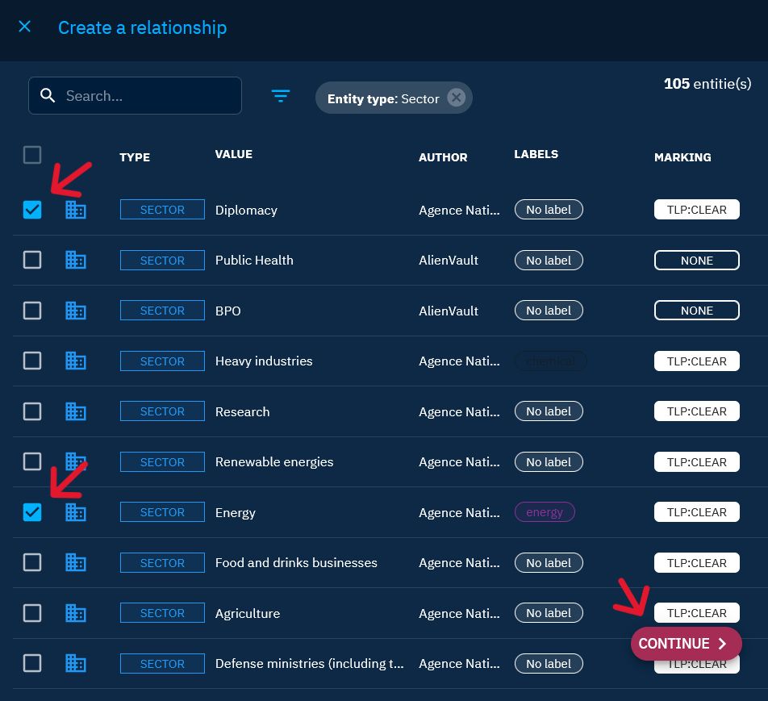
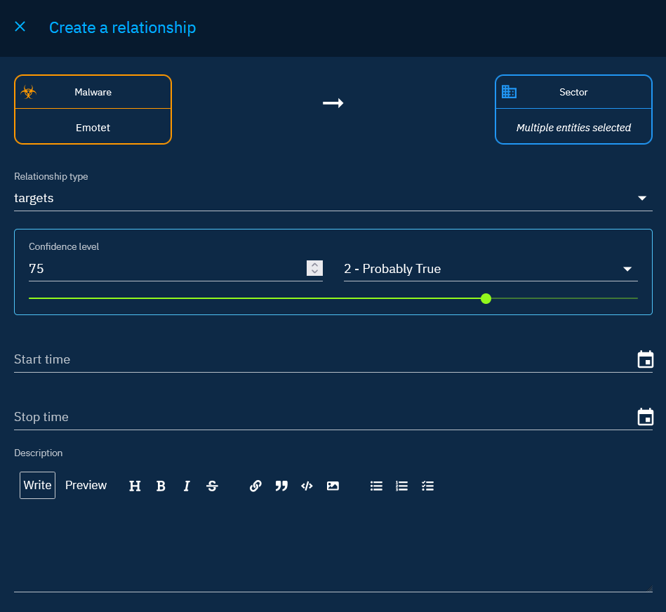

# Manual creations

Manual data creation in OpenCTI is an intuitive process that occurs throughout the platform. This page provides guidance on two key aspects of manual creation: Entity creation and Relationship creation.

## Entity creation

To create an entity:

1. Navigate to the relevant section: Be on the section of the platform related to the object type you want to create.
2. Click on the "+" icon: Locate the "+" icon located at the bottom right of the window. 
3. Fill in entity-specific fields: A form on the right side of the window will appear, allowing to fill in specific fields of the entity. Certain fields are inherently obligatory, and administrators have the option to designate additional mandatory fields ([See here](../administration/entities.md#attributes-section) for more information). 
4. Click on "Create": Once you've filled in the desired fields, click on "create" to initiate the entity creation process.

## Relationship creation

Before delving into the creation of relationships between objects in OpenCTI, it's crucial to grasp some foundational concepts. Here are key points to understand:

- On several aspects, including relationships, two categories of objects must be differentiated: [containers](containers.md) (e.g., Reports, Groupings, and Cases) and others. **Containers aren't related to but contains objects**.
- Relationships, like all other entities, are objects. They possess fields, can be linked, and share characteristics identical to other entities.
- Relationships are inherently directional, comprising a "from" entity and a "to" entity. Understanding this directionality is essential for accurate relationship creation.
- OpenCTI supports various relationship types, and their usage depends on the entity types being linked. For example, a "target" relationship might link malware to an organization, while linking malware to an intrusion set might involve a different relationship type.

Now, let’s explore the process of creating relationships. To do this, we will differentiate the case of containers from the others. 

### For container

When it comes to creating relationships within containers in OpenCTI, the process is straightforward. Follow these steps to attach objects to a container:

1. Navigate to the container: Go to the specific container to which you want to attach an object. This could be a Report, Grouping, or Cases.
2. Access the "Entities" tab: Within the container, locate and access the "Entities" tab.
3. Click on the "+" icon: Find the "+" icon located at the bottom right of the window. 
4. Search for entities: A side window will appear. Search for the entities you want to add to the container. 
5. Add entities to the container: Click on the desired entities. They will be added directly to the container.

### For other

When creating relationships not involving a container, the creation method is distinct. Follow these steps to create relationships between entities:

1. Navigate to one of the entities: Go to one of the entities you wish to link. Please be aware that the entity from which you create the relationship will be designated as the "from" entity for that relationship. So the decision of which entity to choose for creating the relationship should be considered, as it will impact the outcome. 
2. Access the "Knowledge" tab: Within the entity, go to the "Knowledge" tab.
3. Select the relevant categories: In the right banner, navigate to the categories that correspond to the object to be linked. The available categories depend on the type of entity you are currently on. For example, if you are on malware and want to link to a sector, choose "victimology."
4. Click on the "+" icon: Find the "+" icon located at the bottom right of the window. 
5. Search for entities: A side window will appear. Search for the entities you want to link.
6. Add entities and click on "Continue": Click on the entities you wish to link. Multiple entities can be selected. Then click on "Continue" at the bottom right. 
7. Fill in the relationship form: As relationships are objects, a creation form similar to creating an entity will appear. 
8. Click on "Create": Once you've filled in the desired fields, click on "create" to initiate the relationship creation process.

## Additional methods

While the aforementioned methods are primary for creating entities and relationships, OpenCTI offers versatility, allowing users to create objects in various locations within the platform. Here's a non-exhaustive list of additional places that facilitate on-the-fly creation:

- Creating entities during relationship creation: During the "Search for entities" phase (see above) of the relationship creation process, click on the "+" icon to create a new entity directly.
- Knowledge graph: Within the knowledge graph - found in the knowledge tab of the containers or in the [investigation functionality](pivoting.md) - users can seamlessly create entities or relationships.
- Inside a workbench: [The workbench](workbench.md) serves as another interactive space where users can create entities and relationships efficiently.

These supplementary methods offer users flexibility and convenience, allowing them to adapt their workflow to various contexts within the OpenCTI platform. As users explore the platform, they will naturally discover additional means of creating entities and relationships.

### Specific case: max confidence level

When creating knowledge in the platform, the maximum confidence level of the users is used. Please navigate to this [page](https://docs.opencti.io/latest/usage/reliability-confidence/) to understand this concept and the impact it can have on the knowledge creation.