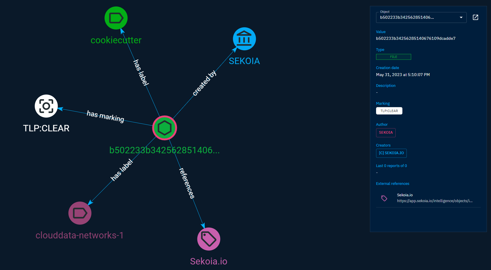

# Nested references and objects

## STIX standard

### Definition

In the [STIX 2.1 standard](https://docs.oasis-open.org/cti/stix/v2.1/stix-v2.1.html), objects can:

1. Refer to other objects in directly in their `attributes`, by referencing one or multiple IDs.
2. Have other objects directly embedded in the entity.

### Example

```json
{
   "type": "intrusion-set",
   "spec_version": "2.1",
   "id": "intrusion-set--4e78f46f-a023-4e5f-bc24-71b3ca22ec29",
   "created_by_ref": "identity--f431f809-377b-45e0-aa1c-6a4751cae5ff", // nested reference to an identity
   "object_marking_refs": ["marking-definition--34098fce-860f-48ae-8e50-ebd3cc5e41da"], // nested reference to multiple marking defintions
   "external_references": [
      {
         "source_name": "veris",
         "external_id": "0001AA7F-C601-424A-B2B8-BE6C9F5164E7",
         "url": "https://github.com/vz-risk/VCDB/blob/125307638178efddd3ecfe2c267ea434667a4eea/data/json/validated/0001AA7F-C601-424A-B2B8-BE6C9F5164E7.json",    
      }
   ],
   "created": "2016-04-06T20:03:48.000Z",
   "modified": "2016-04-06T20:03:48.000Z",
   "name": "Bobcat Breakin",
   "description": "Incidents usually feature a shared TTP of a bobcat being released within the building containing network access...",
   "aliases": ["Zookeeper"],
   "goals": ["acquisition-theft", "harassment", "damage"]
}
```

In the previous example, we have 2 nested references to other objects in:

```json
"created_by_ref": "identity--f431f809-377b-45e0-aa1c-6a4751cae5ff", // nested reference to an identity
"object_marking_refs": ["marking-definition--34098fce-860f-48ae-8e50-ebd3cc5e41da"], // nested reference to multiple marking defintions
```

But we also have a nested object within the entity (an `External Reference`):

```json
"external_references": [
   {
      "source_name": "veris",
      "external_id": "0001AA7F-C601-424A-B2B8-BE6C9F5164E7",
      "url": "https://github.com/vz-risk/VCDB/blob/125307638178efddd3ecfe2c267ea434667a4eea/data/json/validated/0001AA7F-C601-424A-B2B8-BE6C9F5164E7.json",    
   }
]
```

## Implementation

### Modelization

In OpenCTI, all nested references and objects are modelized as relationships, to be able to pivot more easily on labels, external references, kill chain phases, marking definitions, etc.



### Import & export

When importing and exporting data to/from OpenCTI, the translation between nested references and objects to full-fledged nodes and edges is automated and therefore transparent for the users. Here is an example with the object in the graph above:

```json
{
   "id": "file--b6be3f04-e50f-5220-af3a-86c2ca66b719",
   "spec_version": "2.1",
   "x_opencti_description": "...",
   "x_opencti_score": 50,
   "hashes": {
       "MD5": "b502233b34256285140676109dcadde7"
   },
   "labels": [
       "cookiecutter",
       "clouddata-networks-1"
   ],
   "external_references": [
       {
           "source_name": "Sekoia.io",
           "url": "https://app.sekoia.io/intelligence/objects/indicator--3e6d61b4-d5f0-48e0-b934-fdbe0d87ab0c"
       }
   ],
   "x_opencti_id": "8a3d108f-908c-4833-8ff4-4d6fc996ce39",
   "type": "file",
   "created_by_ref": "identity--b5b8f9fc-d8bf-5f85-974e-66a7d6f8d4cb",
   "object_marking_refs": [
       "marking-definition--613f2e26-407d-48c7-9eca-b8e91df99dc9"
   ]
}
```

