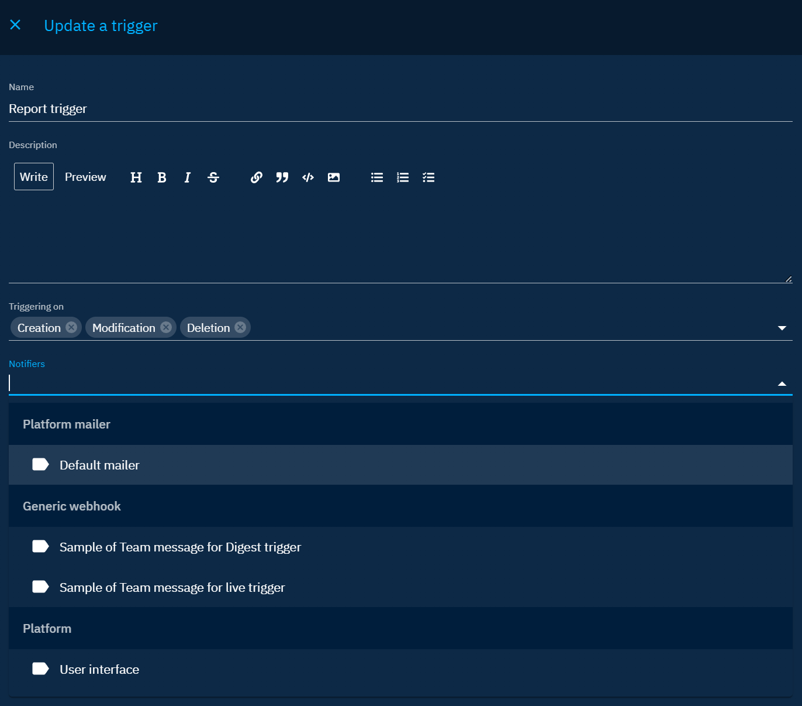

# Notifications and alerting
It is possible to receive `notifications` through different notifier connectors (e.g email or directly on the platform interface) triggered by events such as entity `creation`, `modification` or `deletion`.

  

## Triggers
Each user can create their own triggers. Triggers listen all the events that respect their filters and their event types, and notify the user of those events via the chosen notifier(s).

A platform administrator can create and manage triggers for a user, who will remain the `trigger administrator`, as well as for a group or an organization. Users belonging to this group or organization will then have `read-only` access rights on this trigger.
The user can use filters to ensure that the created triggers are as accurate as possible.

### Instance triggers
Instance triggers are specific live triggers that listen to one or several instance(s). To create an instance trigger, you can

- either use the general trigger creation form in the ‘Triggers and digests’ section,
- either click on the ‘quick subscription’ icon at the top right of an entity overview.

An instance trigger on an entity X notifies the following events:

- update/deletion of X,
- creation/deletion of a relationship from/to X,
- creation/deletion of an entity that has X in its refs (examples: contains X, is shared with X, is created by X...),
- adding/removing X in the ref of an entity (examples: adding X in the author of an entity, adding X in a report…).

Note: The notification of an entity deletion can either provides from the real deletion of an entity, either from a modification of the entity that leads to the user loss of visibility for the entity.

## Digest
A digest allows triggering the sending of notifications based on `multiple triggers` over a given period.

## Notifiers

### Connectors

OpenCTI as some built-in notifier connectors that can be used as notifier in for Notification and Activity alerting. 
Connectors are registered with a schema describing how the connector will interact.
For example, the webhook connector has the following schema:
- A verb (GET, POST, PUT, ...)
- A URL
- A template
- Some params & headers send through the request

OpenCTI provides 3 built-in connectors: a webhook connector, a simplified email connector and a platform mailer connector.
By default, OpenCTI also provides 2 sample notifiers to communicate to Teams through a webhook.

### Usage

The notifiers configured in the admin section can be protected through RBAC and only accessible to specific User/Group/Organization.
Those specified members can use the notifiers directly when configuring their triggers/digest/activity alerts.

The 2 built-in notifiers are still available: *Default mailer* and *User interface*