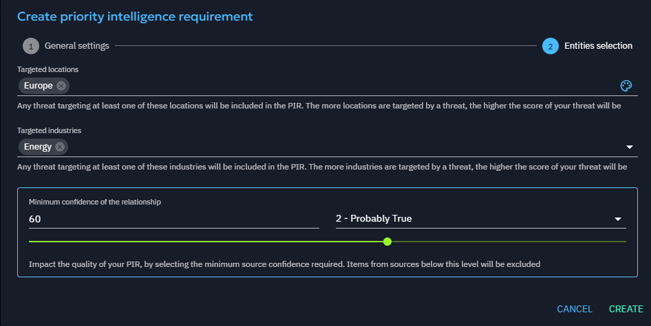
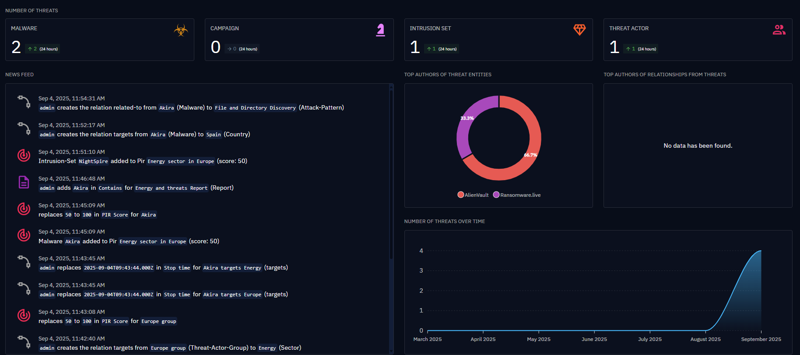

# Priority Intelligence Requirement (PIR)

Priority Intelligence Requirements (PIRs) refer to the most critical information necessary to make informed intelligence-based decisions, achieve key objectives, and assess potential risks. PIRs help focus resources and efforts on gathering and analysing the most relevant and crucial information.

PIRs prioritize the most relevant information based on the user's focus, enabling them to gather and analyze key insights necessary for effective decision-making and risk assessment.

Note that this feature is under Enterprise Edition and requires capabilities (a capability to access and view PIRs, another to create/update/delete PIRs).

## PIR general behavior

A PIR is focused on some entities of interest and gives relevant information about them. You can:
- list these entities,
- filter and order them by their score for the PIR,
- have access to a news feed and a historic displaying the last important event concerning them,
- view, filter and order the containers containing them,
- have a look at different graphs.

These functionalities are detailed in the sections below.

## PIR creation and how entities of interest are determined

How are the entities of interest to focus on determined?

At a PIR creation, the user indicates
- a PIR name,
- a rescan period (1 month by default),
- some criteria and filters to respect to be an entity of interest (for instance: should target the Energy sector or the Europe region with a confidence superior or equal to 60).

The PIR manager is listening to the stream events. If a rescan period has been given, it listens to the stream from the date corresponding to the rescan (for instance: 1 month before now).

For each event, the entity involved is marked as of interest for the PIR, if there is a creation of a relationship:
- respecting one of the PIR criteria (for instance, the event is a relationship 'Malware X targets the Energy sector'),
- and respecting the PIR filters (in the example: the relationship has a confidence superior or equal to 60).

A PIR score is associated with each entity of interest, indicating the percentage of criteria it matches.
With our example, a malware targeting the Energy sector but not Europe will have a score of 50, a malware targeting both will have a score of 100.

If a relationship respecting the filters and criteria is deleted, the score decreases, or the entity is removed from the PIR if there is no other relationship maintaining it in the PIR.

Note that entities matching a criteria because of an event happening before the beginning of the rescan will not be taken into account!
For instance, if a malware has a relationship with Energy that was created 3 months ago, and a PIR is created with a rescan period of 1 month, the malware will not be added to the Pir unless the relationship is updated (and a new event concerning it shows in the stream).

## PIR overview

From the PIR list, clicking on a PIR line redirects to the PIR content. Let's present the different tabs.

In the 'Overview', you have access to:
- the PIR details: rescan period, filters, criteria, creation date, creators, description, processing delay.

The processing delay is the difference between the last stream event and the last event processed by the PIR. It indicates the late compared to the stream.
The number of messages in the queue shows the tasks not yet processed by the worker.

- the Number of threats (number of entities of interest for the Pir) by entity type.
- the News feed: the last historic events of interest give an insight into the last important news in your context (see the 'PIR Activities' section for more information on the events displayed there).
- the Top Authors of threat entities: repartition of the authors of the entities of interest.
- the Top Authors of relationships from Threats: repartition of the authors of the relationships that have caused a marking of entities of interest (ie the 'targets Energy/Europe' relationships in our example).
- the Number of threats over time: the number of entities marked as of interest over time.

## PIR threats

In the threats tab, the list of entities of interest for this PIR is displayed.
In particular, it is possible to order and filter them by score or by the last score evolution date, to highlight the most relevant entities.

On hovering the score, the targets of the entity are displayed, indicating why it is present in the PIR (for instance: because it targets both Europe and Energy).

## PIR Analyses

The Analyses tab gathers the containers containing a threat of interest or an entity in the criteria of the PIR.

Due to technical limitations, only the first 5000 flagged entities are used to retrieve Containers. So, in case of consequent PIRs, this screen may miss some containers.

## PIR Activities

The Activities tab lists the events of interest for the PIR:
- Addition or removal of an entity in the Pir (meaning a new entity is detected as of interest, or an entity is no more of interest),
- Change in the score of threat (increase of score because it targets a new criteria, or decrease of score because it targets no more a criteria),
- Creation or deletion of a relationship involving a threat of interest (except for 'indicates' relationships that are not taken into account because they can be numerous and pollute the activities logs),
- Addition or removal of a threat of interest in a container.

