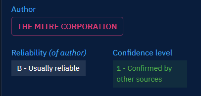
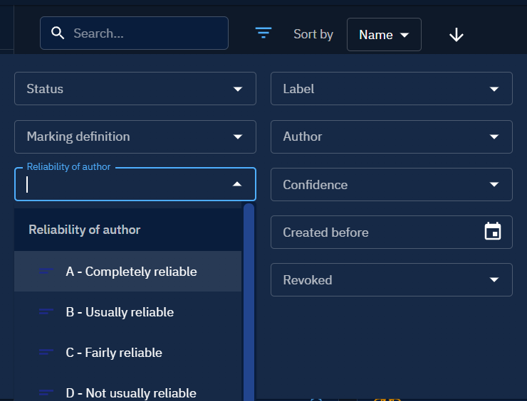
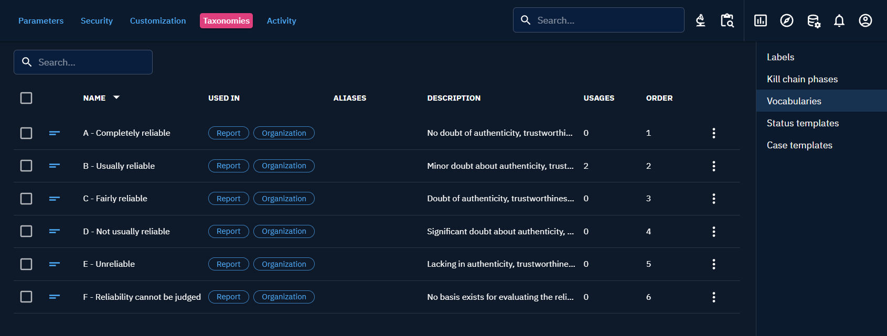

# Reliability and confidence

## Reliability

We can set a reliability value for Organizations, Individuals, Systems and Reports.
For all entities, along with confidence, we display the reliability of source, based on the reliability of the entity's author (organization, individual or system).

You can also filter entities by reliability of author.

Reliability is an open vocabulary that can be customized in Settings -> Taxonomies -> Vocabularies : reliability_ov.

## Confidence

!!! tip "Under construction"

    We are doing our best to complete this page. 
    If you want to participae, dont hesitate to join the [Filigran Community on Slack](https://community.filigran.io) 
    or submit your pull request on the [Github doc repository](https://github.com/OpenCTI-Platform/docs).
