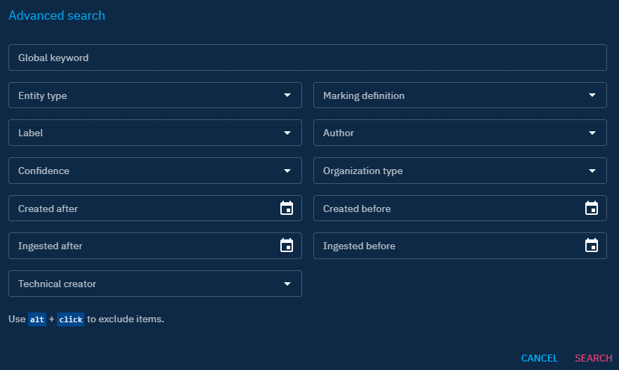

# Search for knowledge

In OpenCTI, you have access to different capabilities to be able to search for knowledge in the platform. In most cases, a search by keyword can be refined with additional filters for instance on the type of object, the author etc.

## Global search

The global search is always available in the top bar of the platform.

<figure markdown>
  
</figure>

This search covers all [STIX Domain Objects (SDOs)](data-model.md#stix-model-section) and [STIX Cyber Observables (SCOs)](data-model.md#stix-model-section) in the platform. The search results are sorted according to the following behaviour:

* Priority 1 for exact matching of the keyword in one attribute of the objects.
* Priority 2 for partial matching of the keyword in the `name`, the `aliases` and the `description` attributes (full text search).
* Priority 3 for partial matching of the keyword in all other attributes (full text search).

If you get unexpected result, it is always possible to add some filters after the initial search:

Also, using the `Advanced search` button, it is possible to directly put filters in a global search:

### Extended search to uploaded files content

!!! tip "Enterprise edition"

    Extended search to files content is available under the "Filigran entreprise edition" license.

    [Please read the dedicated page to have all information](../administration/enterprise.md)

It's possible to extend the global search by keywords to the content of documents uploaded to the platform via the Data import tab, or directly linked to an entity via its Data tab.

#### Extended search requirements

**Files indexation requires to have one of these database configurations :**

* Elasticsearch >= 8.4
* Elasticsearch < 8.4 with [ingest-attachment plugin](https://www.elastic.co/guide/en/elasticsearch/plugins/8.3/ingest-attachment.html)
* OpenSearch with [ingest-attachment plugin](https://opensearch.org/docs/2.9/install-and-configure/plugins/)

#### Extended search configuration

File indexing can be configured via the ``File indexing`` tab in the ``Settings`` menu.
The configuration and impact panel shows all the file types that can be indexed, as well as the volume of data involved.
It is also possible to include or exclude uploaded files at global level, and to restrict file indexing to certain entities.

Currently supported mime types : `text/plain`, `text/csv`, `application/pdf`, `application/vnd.ms-excel`, `application/vnd.openxmlformats-officedocument.spreadsheetml.sheet` (excel sheets).

Once indexing has been launched by pressing the ``Start`` button, you can view its progress or ``Pause`` it. You can also use the ``Reset`` button to delete all indexed files from the database.
It runs every 5 minutes to index last uploaded files.

## Bulk search

The bulk search capabilities is available in the top bar of the platform and allows you to copy paste a list of keyword or objects (ie. list of domains, list of IP addresses, list of vulnerabilities, etc.) to search in the platform:

When searching in bulk, OpenCTI is only looking for an exact match in some properties:

* `name`
* `aliases`
* `x_opencti_aliases`
* `x_mitre_id`
* `value`
* `subject`
* `abstract`
* `hashes_MD5`
* `hashes_SHA1`
* `hashes_SHA256`
* `hashes_SHA512`
* `x_opencti_additional_names`

When something is not found, it appears in the list as `Unknown` and will be excluded if you choose to export your search result in a JSON STIX bundle or in a CSV file.

## Contextual search

In most of the screens of knowledge, you always have a contextual search bar allowing you to filter the list you are on:

The search keyword used here is taken into account if you decide to export the current view in a file such as a JSON STIX bundle or a CSV file.

## Other search bars

Some other screens can contain search bars for specific purposes. For instance, in the graph views to filter the nodes displayed on the graph:

