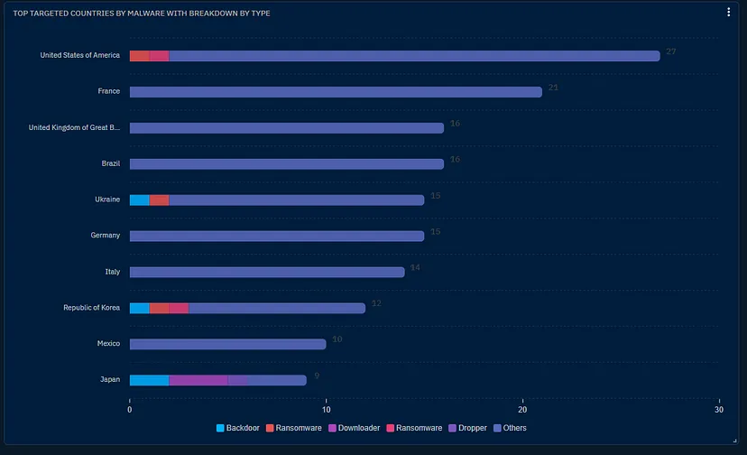
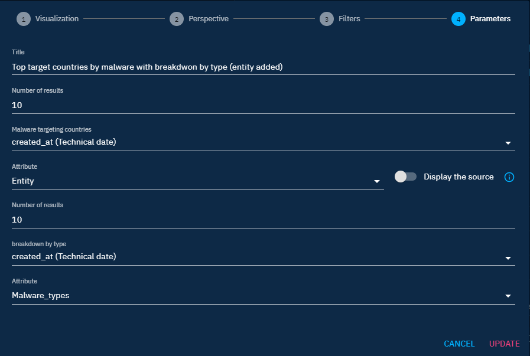
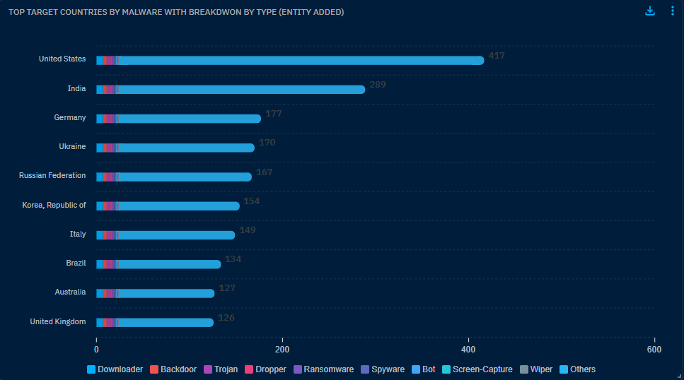
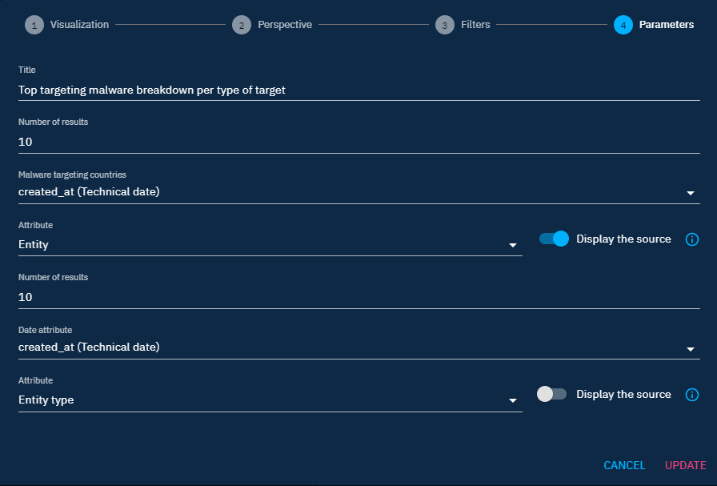
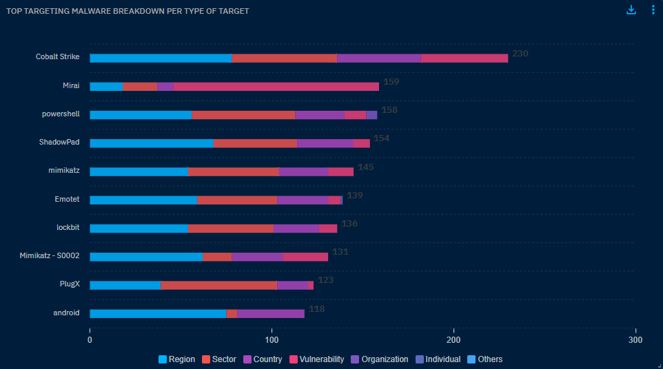

# Pro-tips on widget creation

Previously, the creation of widgets has been covered. To help users being more confident in creating widgets, here are some details to master the widget creation.

## How to choose the appropriate widget visualization for your use case?

We can classify the widgets in 3 different types.

### Single dimension widgets

Use these widgets when you would like to display information about one single type of object (entity or relation).

- **Widget visualizations: number, list, list (distribution), timeline, donuts, radar, map, bookmark, tree map.**
- Use case example: view the amount of malware in platform (number widget), view the top 10 threat actor group target a specific country (distribution list widget), etc.

### Multi dimension widgets

Use these widgets if you would like to compare or have some insights about similar types of object (up to 5).

- **Widget visualizations: line, area, heatmap, vertical bars.**
- Use case example: view the amount of malware, intrusion sets, threat actor groups added in the course of last month in the platform (line or area widget).
- Caution: these widgets need to use the same "type" of object to work properly. You always need to add relationships in the filter view if you have selected a "knowledge graph" perspective. If you have selected the knowledge graph entity, adding "Entities" (click on `+ entities`) will not work, since you are not counting the same things.

### Break down widgets

Use this widget if you want to divide your data set into smaller parts to make it clearer and more useful for analysis.

- **Widget visualization: horizontal bars.**
- Use case example: view the list of malware targeting a country breakdown by the type of malware.

## Adding datasets to your widget

Adding datasets can serve two purposes: comparing data or breakdown a view to have deeper understanding on what a specific dataset is composed of. 

### Use Case 1: compare several datasets

As mentioned in [How to choose the appropriate widget visualization for your use case?](tips_widget_creation.md#howto-section) section you can add data sets to compare different data. Make sure to add the same type of objects (entities or relations) to be able to compare the same objects, by using access buttons like `+`, `+ Relationships`, or `+ Entities`.

You can add up to 5 different data sets.  The `Label` field allows you to name a data set, and this label can then be shown as a legend in the widget using the `Display legend` button in the widget parameters (see the next section).

### Use case 2: break down your chart

As mentioned in [How to choose the appropriate widget visualization for your use case?](tips_widget_creation.md#howto-section) section you can add data sets to decompose your graph into smaller meaningful chunks. In the below points, you can find some use cases that will help you understand how to structure your data.

You can break down view either by **entity or by relations**, depending on what you need to count.

#### Break down by entity

**Use case example: I need to understand what are the most targeted countries by malware, and have a breakdown for each country by malware type.**

**Process:**

1. To achieve this use case, you first need to select the horizontal bar vizualisation.
2. Then you need to select the knowledge graph perspective.

In the filters view:

3. Then input your main query `Source type = Malware AND Target type = Countries AND Relation type = Targets`. Add a label to your dataset. 
4. Add **an entity data set** by using access button `+ Entities`.
5. Add the following filters `Entity type = Malware AND In regards of = targets`. Add a label to your dataset.

In the parameter view:

6. Attribute (of your relation) = entity (so that you display the different entities values)
7. Display the source toggle = off
8. Attribute (of your entity malware) = Malware type (since you want to break down your relations by the malware types)

As a result, you get a list of countries broken down by malware types.

#### Break down by relation

**Use case example: I need to understand what are the top targeting malware and have a breakdown of the top targets per malware**

**Process:**

1. To achieve this use case, you first need to select the horizontal bar vizualisation.
2. Then you need to select the knowledge graph perspective.

In the filters view:

3. Then input your main query `Source type = Malware AND Relation type = Targets`. Add a label to your dataset. 
4. Add **a relation data set** by using access button  `+ Relationships`
5. Add the following filters `Source type = Malware AND Relation type = targets`. Add a label to your dataset.

In the parameter view:

7. Attribute (of your relation): entity (so that you display the different entities values)
8. Display the source toggle = on
9. Attribute (of your entity malware) = Malware type (since you want to break down your relations by the malware types)
10. Display the source toggle = off

As a result, you get a list of malware with the breakdown of their top targets.

## More use case

To see more use cases, feel free to have a look at this [blog post](https://blog.filigran.io/new-octi-dashboards-the-first-graph-dashboarding-engine-for-the-stix-model-406e4eb5842a) that will provide you additional information.
