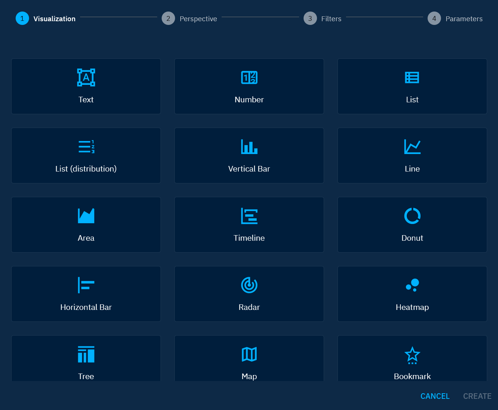
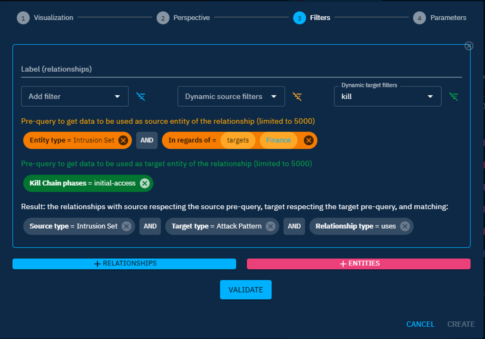
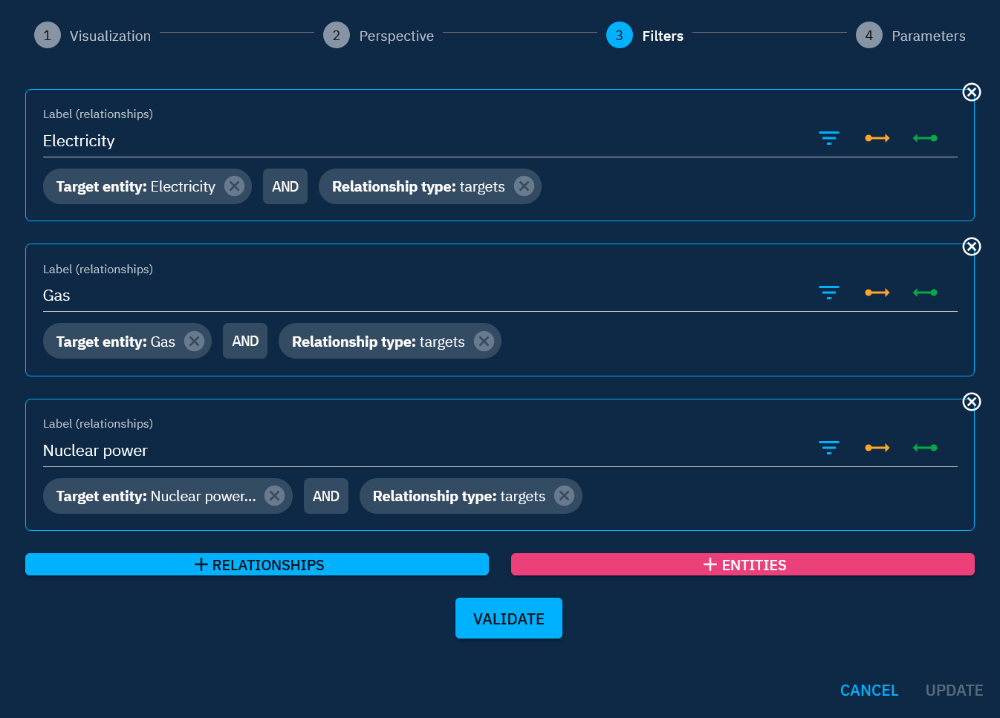
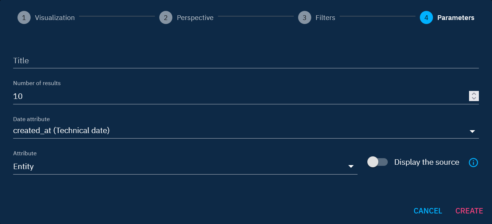

# Widget creation

Creating widgets on the [dashboard](dashboards.md) involves a four-step configuration process. By navigating through these configuration steps, users can design widgets that meet their specific requirements.

## Widget configuration

#### 1. Visualization

Users can select from 15 diverse visualization options to highlight different aspects of their data. This includes simple views like counters and lists, as well as more intricate views like heatmaps and trees. The chosen visualization impacts the available perspectives and parameters, making it crucial to align the view with the desired data observations. Here are a few insights:

- Line and Area views: Ideal for visualizing activity volumes over time.
- Horizontal bar views: Designed to identify top entities that best satisfy applied filters (e.g., top malware targeting the Finance sector).
- Tree views: Useful for comparing activity volumes.
- ...

#### 2. Perspective

A perspective is the way the platform will count the data to display in your widgets:

- **Entities Perspective:** Focuses on entities, allowing observation of simple knowledge based on defined filters and criteria. The count will be based on entities only.
- **Knowledge Graph Perspective:** Concentrates on relationships, displaying intricate knowledge derived from relationships between entities and specified filters.  The count will be based on relations only.
- **Activity & History Perspective:** Centers on activities within the platform, not the knowledge content. This perspective is valuable for monitoring user and connector activities, evaluating data sources, and more.

#### 3. Filters

#### Generic knowledge

Filters vary based on the selected perspective, defining the dataset to be utilized in the widget. Filters are instrumental in narrowing down the scope of data for a more focused analysis.

While filters in the "Entities" and "Activity & History" perspectives align with the platform's familiar search and feed creation filters, the "Knowledge Graph" perspective introduces a more intricate filter configuration.Therefore, they need to be addressed in more detail. Three types of filters are available in the Knowledge Graph perspective:

#### Filter in the context of Knowledge graph

2 types of filters are available in the Knowledge Graph perspective:
- **Main query filter**
    - **Classic filters (gray):** Define the relationships to be retrieved, forming the basis on which the widget displays data. Remember, statistics in the Knowledge Graph perspective are based on relationships.
  
- **Pre-query filters**
    - Pre-query filters are used to **provide to your main query** a specific dataset. In other words, instead of making a query on the whole data set of your platform, you can already target a subset of data that will match certain criteria. They are 2 types of pre-query filters:
        - **Dynamic filters on the source (orange):** Refine data by filtering on entities positioned as the source (in the "from" position) of the relationship.
        - **Dynamic filters on the target (green):** Refine data by filtering on entities positioned as the target (in the "to" position) of the relationship.

**Caution**: the pre-query is limited to 5000 results. If your pre-query results in having more than 5000 results, your widget will only display the 5000 results matching your query, resulting in a wrong view. To avoid this issue, be specific in your pre-query filters to avoid this issue.

**Example scenario:**

Let's consider an example scenario: Analyzing the initial access attack patterns used by intrusion sets targeting the finance sector.

1. Classic filters: Define the relationships associated with the use of attack patterns by intrusion sets
2. Dynamic filters on the source (Orange): Narrow down the data by filtering on intrusion sets targeting the finance sector.
3. Dynamic filters on the target (Green): Narrow down the data by filtering on attack patterns associated with the kill chain's initial access phase.

By leveraging these advanced filters, users can conduct detailed analyses within the Knowledge Graph perspective, unlocking insights that are crucial for understanding intricate relationships and statistics.

In certain views, you can access buttons like `+`, `+ Relationships,` or `+ Entities`. These buttons enable you to incorporate different data into the same widget for comparative analysis. For instance, in a Line view, adding a second set of filters will display two curves in the widget, each corresponding to one of the filtered data sets. Depending on the view, you can work with 1 to 5 sets of filters. The `Label` field allows you to name a data set, and this label can then be shown as a legend in the widget using the `Display legend` button in the widget parameters (see the next section).

#### 4. Parameters

Parameters depend on the chosen visualization and allow users to define widget titles, choose displayed elements from the filtered data, select data reference date, and configure various other parameters specific to each visualization.

For the "Knowledge Graph" perspective, a critical parameter is the `Display the source` toggle. This feature empowers users to choose whether the widget displays entities from the source side or the target side of the relationships.

- Toggle ON ("Display the source"): The widget focuses on entities positioned as the source of the relationships (in the "from" position).
- Toggle OFF ("Display the target"): The widget shifts its focus to entities positioned as the target of the relationships (in the "to" position).

This level of control ensures that your dashboard aligns precisely with your analytical objectives, offering a tailored perspective based on your data and relationship.

## Prerequisite knowledge

To successfully configure widgets in OpenCTI, having a solid understanding of the platform's data modeling is essential. Knowing specific relationships, entities, and their attributes helps refine filters accurately. Let's explore two examples.

**Scenarios 1:**

Consider the scenario where you aim to visualize relationships between intrusion sets and attack patterns. In this case, the relevant relationship type connecting intrusion sets to attack patterns is labeled as "Uses" (as illustrated in the "Filters" section).

**Scenarios 2:**

Suppose your goal is to retrieve all reports associated with the finance sector. In this case, it's essential to use the correct filter for the finance sector. Instead of placing the finance sector in the "Related entity" filter, it should be placed in the "Contains" filter. Since a Report is a container object (like Cases and Groupings), it **contains** entities within it and is **not related to** entities.

### Key data modeling aspects

- Entities: Recognizing [container](containers.md) (e.g. Reports, Cases and Groupings) and understanding the difference with non-container.
- Relationships: Identifying the relationship types connecting entities.
- Attributes: Understanding entities and relationships attributes for effective filtering.

Having this prerequisite knowledge allows you to navigate the widget configuration process seamlessly, ensuring accurate and insightful visualizations based on your specific data requirements.
