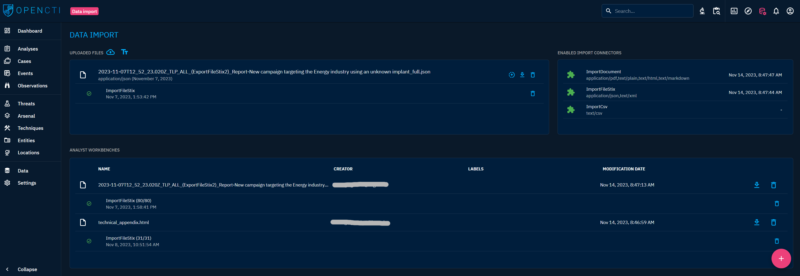
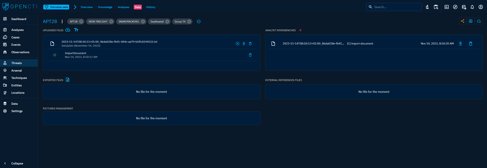
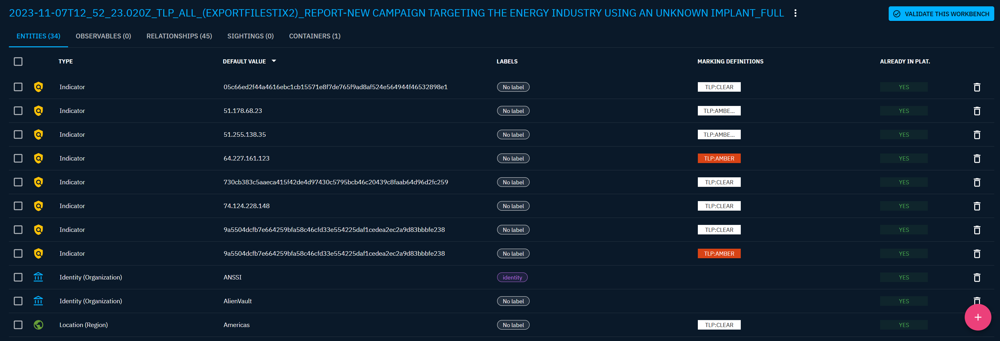
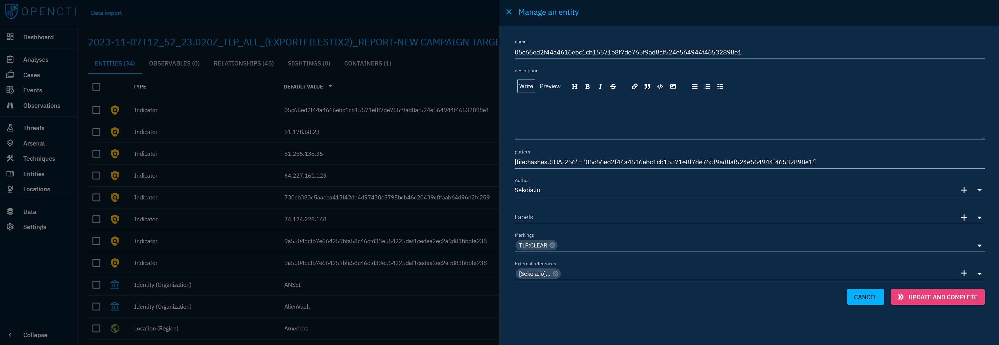

# Analyst workbench

Workbenches serve as dedicated workspaces for manipulating data before it is officially imported into the platform. 

## Location of use

The workbenches are located at various places within the platform:

#### Data import and analyst workbenches window

This window encompasses all the necessary tools for importing a file. Files imported through this interface will subsequently be processed by the import connectors, resulting in the creation of workbenches. Additionally, analysts can manually create a workbench by clicking on the "+" icon at the bottom right of the window.

#### Data tabs of all entities

Workbenches are also accessible through the "Data" tabs of entities, providing convenient access to import data associated with the entity.

## Operation

Workbenches are automatically generated upon the import of a file through an import connector. When an import connector is initiated, it scans files for recognizable entities and subsequently creates a workbench. All identified entities are placed within this workbench for analyst reviews.
Alternatively, analysts have the option to manually create a workbench by clicking on the "+" icon at the bottom right of the "Data import and analyst workbenches" window.

The workbench being a draft space, the analysts use it to review connector proposals before finalizing them for import. Within the workbench, analysts have the flexibility to add, delete, or modify entities to meet specific requirements.

Once the content within the workbench is deemed acceptable, the analyst must initiate the ingestion process by clicking on `Validate this workbench`. This action signifies writing the data in the knowledge base.

!!! note "Workbenches are drafting spaces"

    Until the workbench is validated, the contained data remains in draft form and is not recorded in the knowledge base. This ensures that only reviewed and approved data is officially integrated into the platform.

For more information on importing files, refer to the [Import from files](import-files.md) documentation page.
